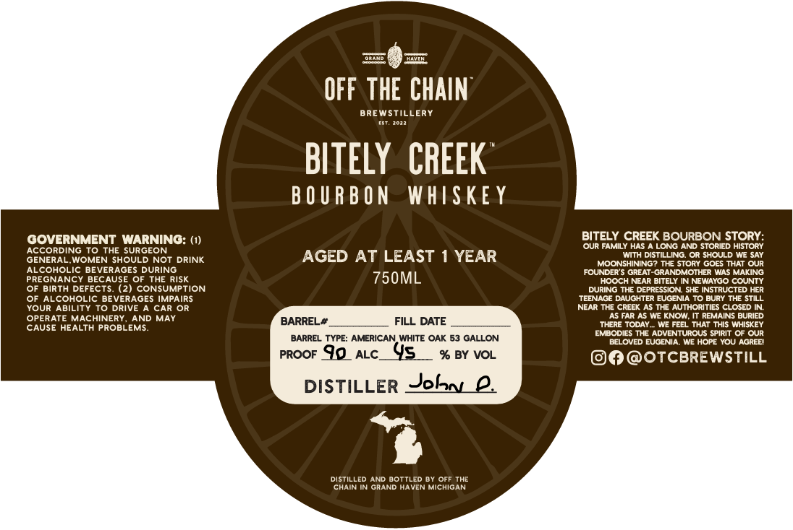

# TTB COLA Label Images - TTBID 26043001000298

**Brand Name:** BITLEY CREEK

**Issue Date:** 02/12/2026

**Origin Code:** 06

**Product Class/Type:** 141

**Source:** [TTB Public COLA Registry](https://ttbonline.gov/colasonline/viewColaDetails.do?action=publicFormDisplay&ttbid=26043001000298)

## Label Images

### Label 1

## Extracted Label Text

*Text extracted via OCR - may contain errors*

### Label 1

OFF

Th

HE

CHAIN

BREWSTILLERY

wr. 2022

BITELY CREEK

BOURBON WHISKEY

BITELY CREEK BOURBON STORY:

GOVERNMENT WARNING: (1)

‘OUR FAMILY HAS A LONG AND STORIED HISTORY

ACCORDING TO THE SURGEON

'WITH DISTILLING. OR SHOULD WE SAY

GENERAL, WOMEN SHOULD NOT DRINK

AGED AT LEAST 1 YEAR

MOONSHINING? THE STORY GOES THAT OUR

ALCOHOLIC BEVERAGES DURING

FOUNDER'S GREAT-GRANDMOTHER WAS MAKING

PREGNANCY BECAUSE OF THE RISK

750ML

HOOCH NEAR BITELY IN NEWAYGO COUNTY

OF BIRTH DEFECTS. (2) CONSUMPTION

DURING THE DEPRESSION. SHE INSTRUCTED HER

OF ALCOHOLIC BEVERAGES IMPAIRS

‘TEENAGE DAUGHTER EUGENIA TO BURY THE STILL

YOUR ABILITY TO DRIVE A CAR OR

NEAR THE CREEK AS THE AUTHORITIES CLOSED IN.

OPERATE MACHINERY, AND MAY

‘AS FAR AS WE KNOW, IT REMAINS BURIED

CAUSE HEALTH PROBLEMS.

BARREL#.

FILL DATE

‘THERE TODAY... WE FEEL THAT THIS WHISKEY

EMBODIES THE ADVENTUROUS SPIRIT OF OUR

BARREL TYPE: AMERICAN WHITE OAK 53 GALLON

BELOVED EUGENIA, WE HOPE YOU AGREE!

prooF JQ atc.

% BY VOL

©@ @OTCBREWSTILL

DISTILLER Solan 2.

+;

DISTILLED AND BOTTLED BY OFF THE

‘CHAIN IN GRAND HAVEN MICHIGAN
