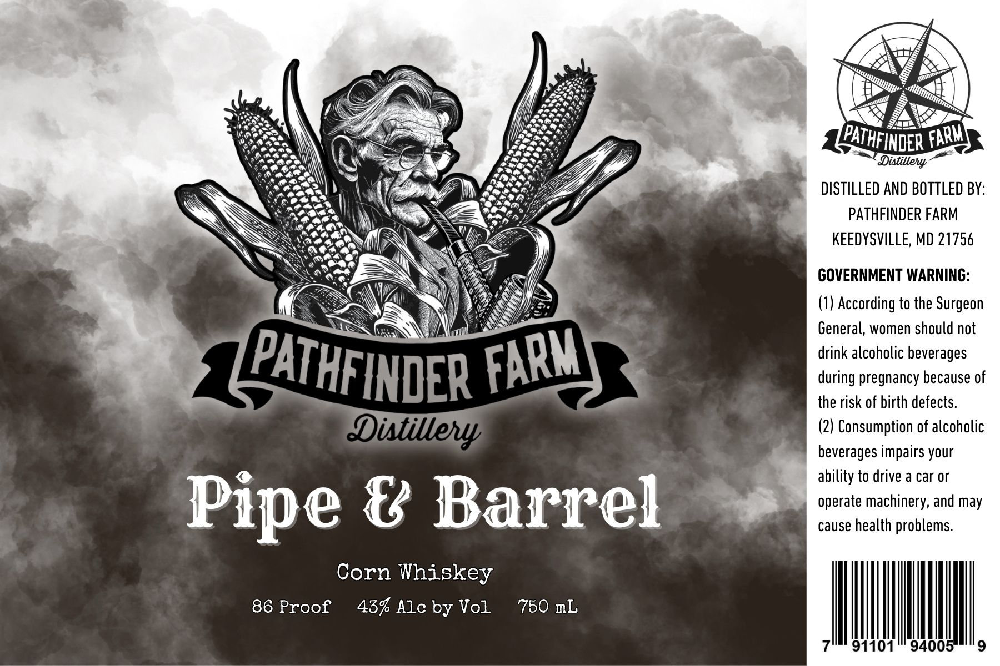

# TTB COLA Label Images - TTBID 26043001000300

**Brand Name:** PATHFINDER FARM

**Fanciful Name:** PIPE AND BARREL

**Issue Date:** 02/12/2026

**Origin Code:** 25

**Product Class/Type:** 143

**Source:** [TTB Public COLA Registry](https://ttbonline.gov/colasonline/viewColaDetails.do?action=publicFormDisplay&ttbid=26043001000300)

## Label Images

### Label 1

## Extracted Label Text

*Text extracted via OCR - may contain errors*

### Label 1

ew

Os

Bin,

AG

Ory

xf

ee

=~

Pores

Non ay

7 D

We

lopene

PATH

see,

[LED

Cine,

Led

FINDER FARMS 9

Scee\

\ys

‘we

kA Ke

ome s

Distillery ~

AD

™

LX)

DISTILLED AND BOTTLED BY

CRG

AA:

\\

LAeey,

Vi

ate

BES

ae2

noe,

,

PATHFINDER FARM

OPA

Vinee

Nee

NS

KEEDYSVILLE, MD 21756

MAAS

ay

\

wy

\\

A;

o]

l,

GOVERNMENT WARNING

Ss

WA

ES

(1) According to the Surgeon

Ni

General, women should not

drink alcoholic beverages

Ty

during pregnancy because of

CT

NDER f

the risk of birth defects

(77

(2) Consumption of alcoholic

beverages impairs your

ability to drive a car or

operate machinery, and may

cause health problems.

Pipe @ Barrel

Corn Whiskey

86 Proof 43% Ale by Vol

750 mL

ll

7 91101" 9400:
