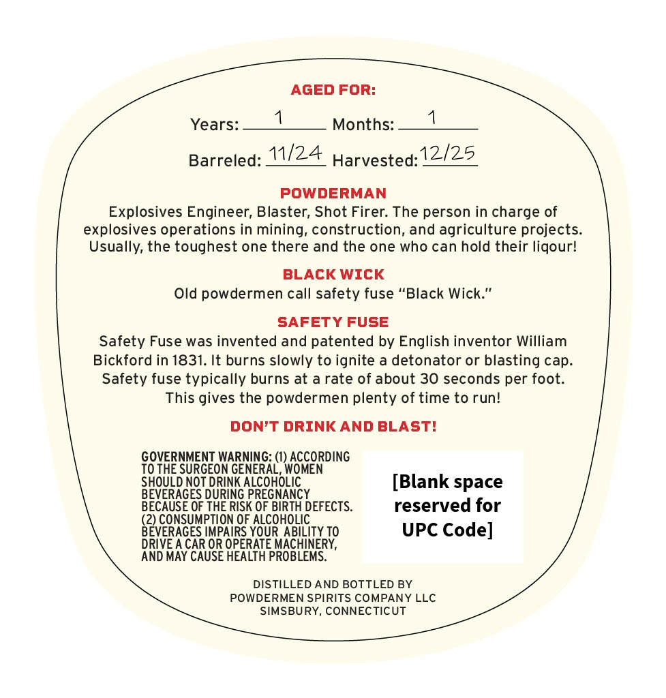
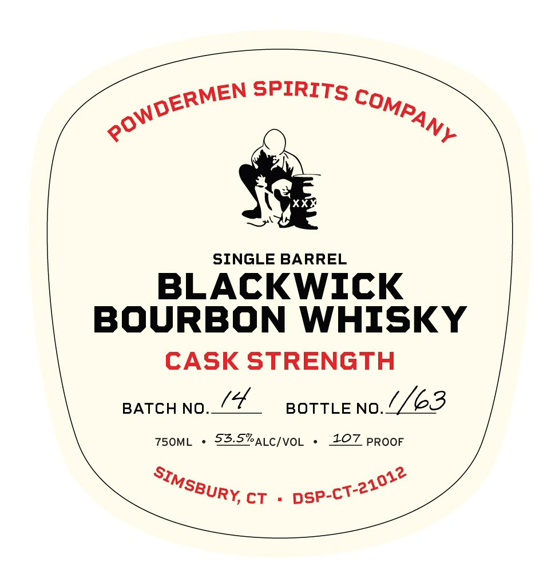

# TTB COLA Label Images - TTBID 26043001000413

**Brand Name:** BLACKWICK BOURBON WHISKY CASK STRENGTH

**Issue Date:** 02/17/2026

**Origin Code:** 14

**Product Class/Type:** 141

**Source:** [TTB Public COLA Registry](https://ttbonline.gov/colasonline/viewColaDetails.do?action=publicFormDisplay&ttbid=26043001000413)

## Label Images

### Back Label

### Front Label

## Extracted Label Text

*Text extracted via OCR - may contain errors*

### Back Label

AGED FOR:
Years:__!___ Months:__1___
Barreled: 2A Harvested: 12/25
POWDERMAN
Explosives Engineer, Blaster, Shot Firer. The person in charge of
explosives operations in mining, construction, and agriculture projects.
Usually, the toughest one there and the one who can hold their liqour!
BLACK WICK
Old powdermen call safety fuse “Black Wick.”
SAFETY FUSE
Safety Fuse was invented and patented by English inventor William
Bickford in 1831. It burns slowly to ignite a detonator or blasting cap.
Safety fuse typically burns at a rate of about 30 seconds per foot.
This gives the powdermen plenty of time to run!
DON’T DRINK AND BLAST!
GOVERNMENT WARNING: (1) ACCORDING
TO THE SURGEON GENERAL, WOMEN
SHOULD NOT DRINK ALCOHOLIC [Blank space
BEVERAGES DURING PREGNANCY
BECAUSE OF THE RISK OF BIRTH DEFECTS. reserved for
(2) CONSUMPTION OF ALCOHOLIC
BEVERAGES IMPAIRS YOUR ABILITY TO UPC Code]
DRIVE A CAR OR OPERATE MACHINERY,
AND MAY CAUSE HEALTH PROBLEMS.
DISTILLED AND BOTTLED BY
POWDERMEN SPIRITS COMPANY LLC
SIMSBURY, CONNECTICUT

### Front Label

ERMEN SPIRITS cp Mag

p

~—*

SINGLE BARREL

BLACKWICK

BOURBON WHISKY

CASK STRENGTH

BATCH NO. Gs

BOTTLE no. 3

750ML + 23-5%atc/voL

107 proor

SBury, cr

psP-

cr?
