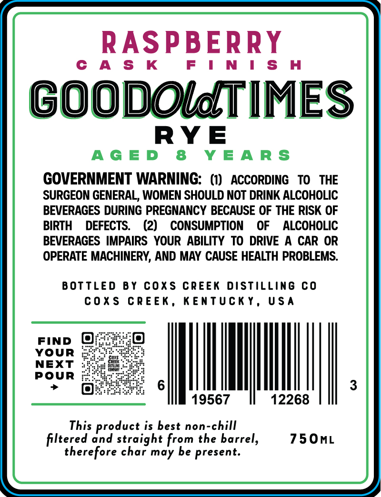
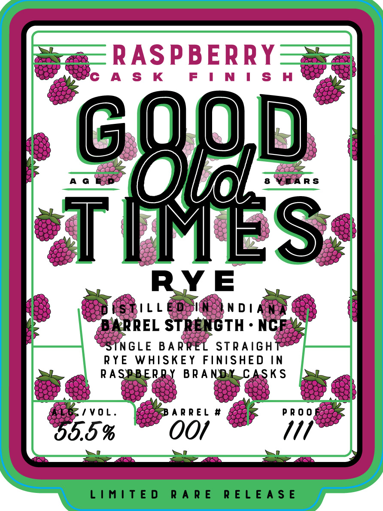

# TTB COLA Label Images - TTBID 26043001000444

**Brand Name:** GOOD OLD TIMES RYE

**Fanciful Name:** RASPBERRY

**Issue Date:** 02/13/2026

**Origin Code:** 22

**Product Class/Type:** 102

**Source:** [TTB Public COLA Registry](https://ttbonline.gov/colasonline/viewColaDetails.do?action=publicFormDisplay&ttbid=26043001000444)

## Label Images

### Back Label

### Front Label

## Extracted Label Text

*Text extracted via OCR - may contain errors*

### Back Label

RASPBERRY

CAS K

N

ISH

GOODOMTIMES

RYE

AGED 8 YEARS

GOVERNMENT WARNING: (1) ACCORDING TO THE

SURGEON GENERAL, WOMEN SHOULD NOT DRINK ALCOHOLIC

BEVERAGES DURING PREGNANCY BECAUSE OF THE RISK OF

BIRTH DEFECTS. (2) CONSUMPTION OF ALCOHOLIC

BEVERAGES IMPAIRS YOUR ABILITY TO DRIVE A CAR OR

OPERATE MACHINERY, AND MAY CAUSE HEALTH PROBLEMS.

BOTTLED BY COXS CREEK DISTILLING CO

COXS CREEK, KENTUCKY, USA

FIND @

YOUR

NEXT

POUR

MIN.

|

19567

12268

This product is best non-chill

750mL

filtered and straight from the barrel,

therefore char may be present.

### Front Label

la!

.

9)

: i

38;

1

Cc

‘es

<—

ms

a

549)

tS

ta

iy

oe

DE

A?

(eve

Pa

AG

wae

RS

a

De

q

Be

oe)

e.g

“ORE

YE

>

(SRL

“y

NDI

iS

=a

‘a

eos,

oe

oy

REL S

i

TH:

4

160,

>

oe,

ee

8

i

ie

NGLE BARR

STRAIGH

RYE WHISKEY FINISHED IN

RA

KS

on

ge

)

see)

ae

tH

ts 5

Ee eS 6

/VOL

ARREL #

PROO

os:

EAS

lose,

ya

lg

es:

oa)

0.5 %

OO/

M1

a Ee fF Eee > ——“3
