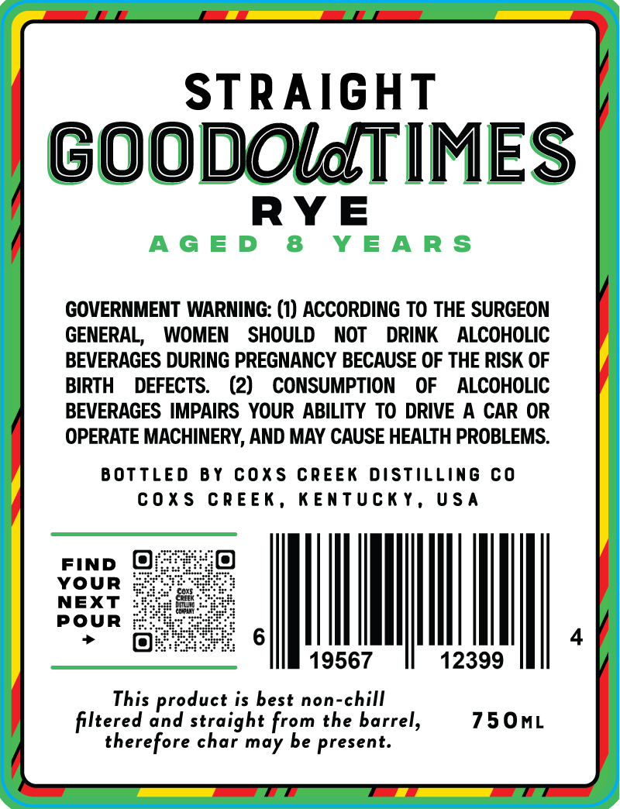
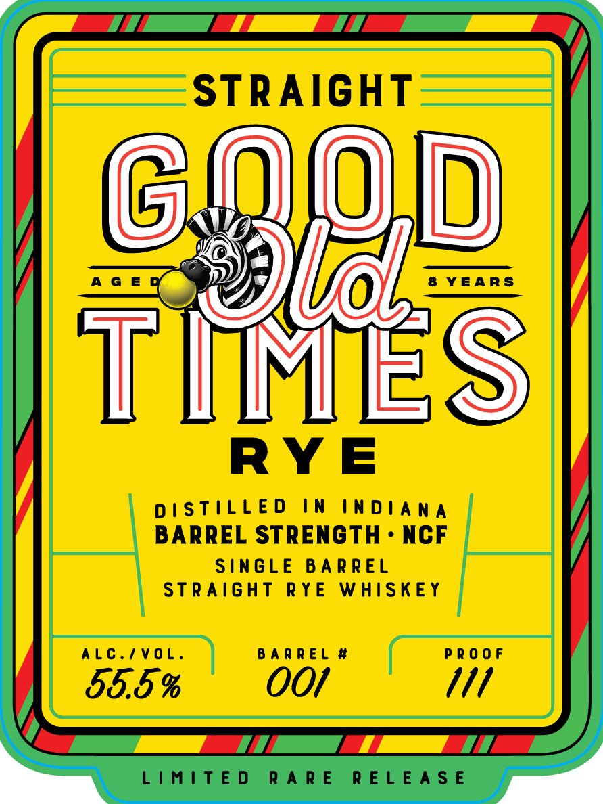

# TTB COLA Label Images - TTBID 26043001000459

**Brand Name:** GOOD OLD TIMES RYE

**Fanciful Name:** STRAIGHT

**Issue Date:** 02/13/2026

**Origin Code:** 22

**Product Class/Type:** 102

**Source:** [TTB Public COLA Registry](https://ttbonline.gov/colasonline/viewColaDetails.do?action=publicFormDisplay&ttbid=26043001000459)

## Label Images

### Back Label

### Front Label

## Extracted Label Text

*Text extracted via OCR - may contain errors*

### Back Label

RYE
GOVERNMENT WARNING: (1) ACCORDING TO THE SURGEON
GENERAL, WOMEN SHOULD NOT DRINK ALCOHOLIC
BEVERAGES DURING PREGNANCY BECAUSE OF THE RISK OF
BIRTH DEFECTS. (2) CONSUMPTION OF ALCOHOLIC
BEVERAGES IMPAIRS YOUR ABILITY TO DRIVE A CAR OR
OPERATE MACHINERY, AND MAY CAUSE HEALTH PROBLEMS.
BOTTLED BY COXS CREEK DISTILLING CO
COXS CREEK, KENTUCKY, USA
YOUR eyeie tied
NEXT ogee
POUR j2Eie SRERy
> BEETS 6 4
19567 12399
This product is best non-chill
filtered and straight from the barrel, 750mL
therefore char may be present.

### Front Label

SI] / =H |i EE

STRAIGHT

)

J)

|

YEARS

DISTILLED IN INDIANA

RYE

BARREL ress ties NCF

carga RYE IgE

SIN

E BA

ALC./VOL.

BARREL

PROOF

OO/

M1

J 55.5 %

LIMITED RARE RELEASE
