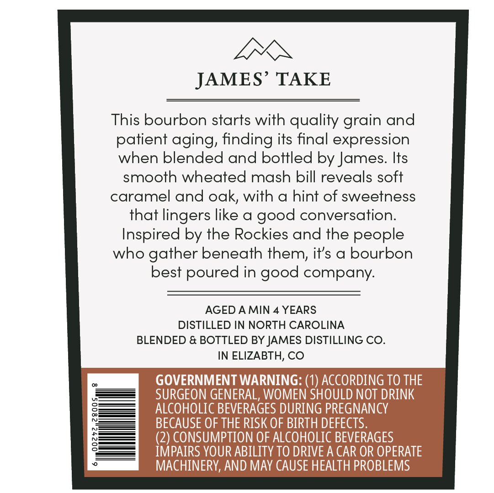
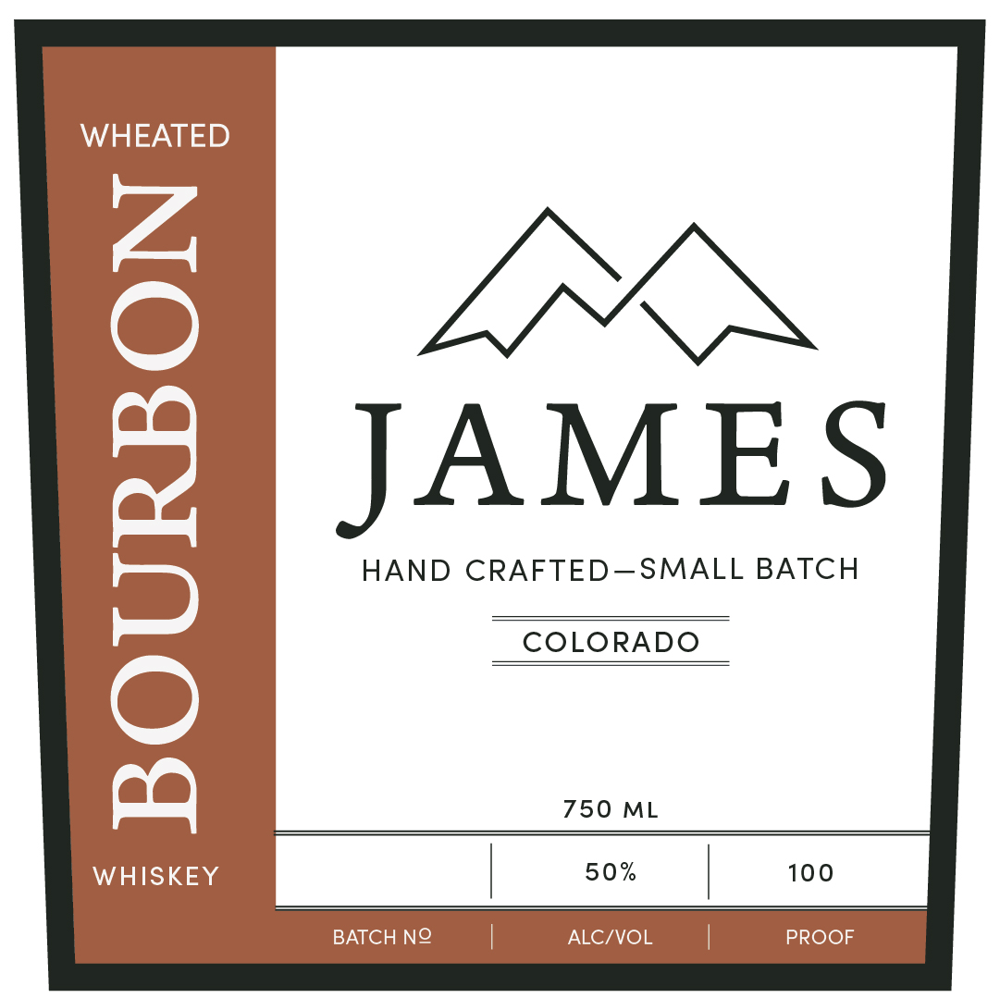

# TTB COLA Label Images - TTBID 26043001000532

**Brand Name:** JAMES

**Issue Date:** 02/27/2026

**Origin Code:** 13

**Product Class/Type:** 141

**Source:** [TTB Public COLA Registry](https://ttbonline.gov/colasonline/viewColaDetails.do?action=publicFormDisplay&ttbid=26043001000532)

## Label Images

### Back Label

### Front Label

## Extracted Label Text

*Text extracted via OCR - may contain errors*

**Detected Proof:** 100
**Detected Age:** 4 Years

### Back Label

VN
JAMES’ TAKE
This bourbon starts with quality grain and
patient aging, finding its final expression
when blended and bottled by James. Its
smooth wheated mash bill reveals soft
caramel and oak, with a hint of sweetness
that lingers like a good conversation.
Inspired by the Rockies and the people
who gather beneath them, it’s a bourbon
best poured in good company.
AGED A MIN 4 YEARS
DISTILLED IN NORTH CAROLINA
BLENDED & BOTTLED BY JAMES DISTILLING CO.
IN ELIZABTH, CO
= OVERNMENT WARNING: (1) ACCORDING TO THE
———J SURGEON GENERAL, WOMEN SHOULD NOT DRINK
§———4 = (2) CONSUMPTION OF ALCOHOLIC BEVERAGES
:———7 _ IMPAIRS YOUR ABILITY TO DRIVE A CAR OR OPERATE
2 MACHINERY, AND MAY CAUSE HEALTH PROBLEMS

### Front Label

WHEATED

JAMES

HAND CRAFTED—SMALL BATCH

COLORADO

750 ML

WHISKEY

50%

100

BATCH NO

PROOF

ALC/VOL
