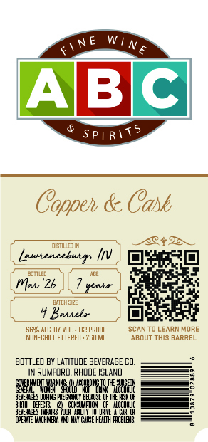
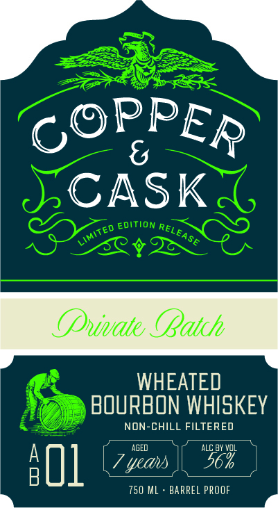

# TTB COLA Label Images - TTBID 26043001000533

**Brand Name:** COPPER & CASK

**Issue Date:** 02/13/2026

**Origin Code:** 40

**Product Class/Type:** 141

**Source:** [TTB Public COLA Registry](https://ttbonline.gov/colasonline/viewColaDetails.do?action=publicFormDisplay&ttbid=26043001000533)

## Label Images

### Back Label

### Front Label

### Label 3

## Extracted Label Text

*Text extracted via OCR - may contain errors*

### Back Label

A\B/C

Coper & Cark

Et

DST

(E

fmssrenceburgs [/V

) fh

ar

ty

Te

Mow '2b \L7

ie.

te

Es

1 Borelr —_ | fa]

ee

oF

NOW-CHLL FLTERED-750 ML

S546 ALC BY VOL 12 PROOF

SCAN TO LEARN MORE

‘ABOUT THIS BARREL

‘BOTTLED BY LATITUDE BEVERAGE CO.

2

IN RUMFORD, RHODE ISLAND

zn

ara

ee, —e

=

=

fev is oe

=<

### Front Label

OPPEp

CASK

BOURBON WHISKEY

CHILL FILTER

alll [7 yes | Se

750 ML - BARREL PROOF

### Label 3

S
