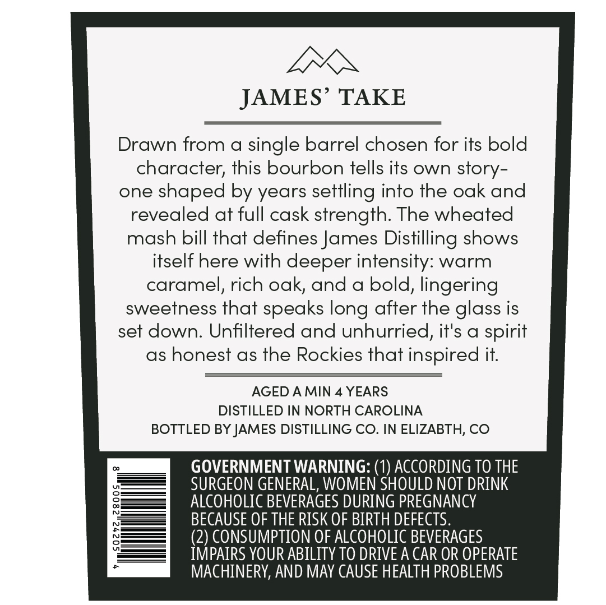
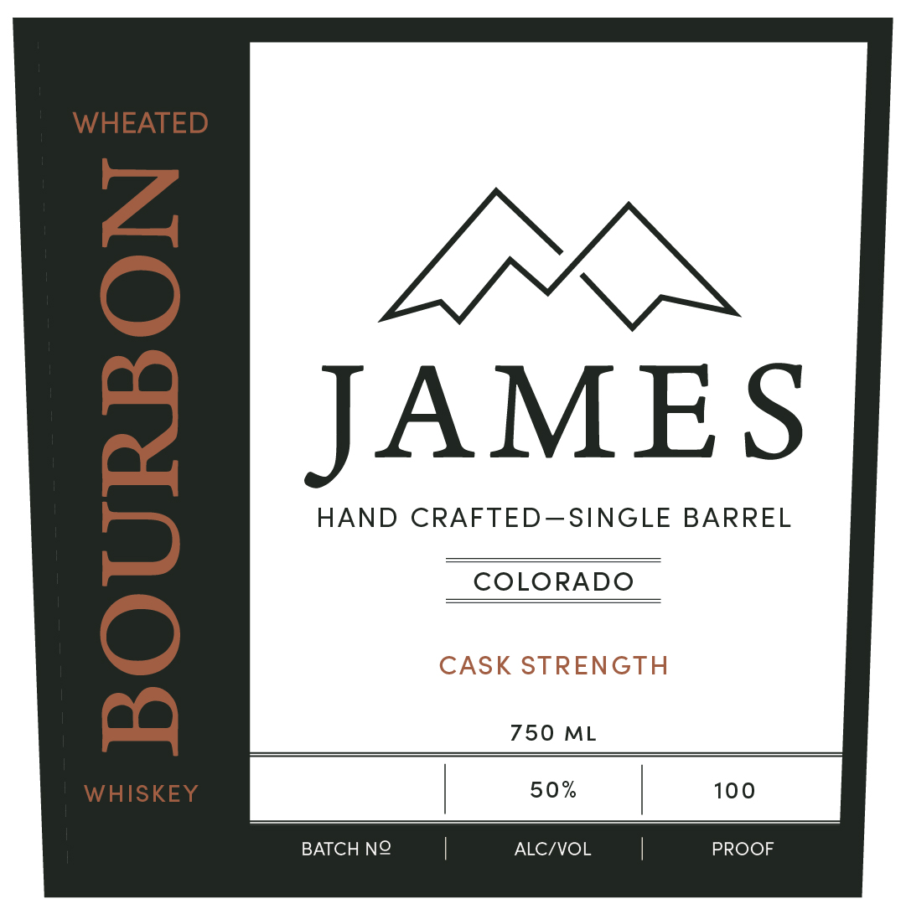

# TTB COLA Label Images - TTBID 26043001000546

**Brand Name:** JAMES

**Issue Date:** 02/25/2026

**Origin Code:** 13

**Product Class/Type:** 141

**Source:** [TTB Public COLA Registry](https://ttbonline.gov/colasonline/viewColaDetails.do?action=publicFormDisplay&ttbid=26043001000546)

## Label Images

### Back Label

### Front Label

## Extracted Label Text

*Text extracted via OCR - may contain errors*

**Detected Proof:** 100
**Detected Age:** 4 Years

### Back Label

LEX

JAMES’ TAKE

Drawn from a single barrel chosen for its bold

character, this bourbon tells its own story-

one shaped by years settling into the oak and

revealed at full cask strength. The wheated

mash bill that defines James Distilling shows

itself here with deeper intensity: warm

caramel, rich oak, and a bold, lingering

sweetness that speaks long after the glass is

set down. Unfiltered and unhurried, it's a spirit

as honest as the Rockies that inspired it.

AGED AMIN 4 YEARS

DISTILLED IN NORTH CAROLINA

BOTTLED BY JAMES DISTILLING CO. IN ELIZABTH, CO

GOVERNMENT WARNING: (1) ACCORDING TO THE

ALCOHOLIC BEVERAGES DURING PREGNANCY

SURGEON GENERAL, WOMEN SHOULD NOT DRINK

BECAUSE OF THE RISK OF BIRTH DEFECTS.

(2) CONSUMPTION OF ALCOHOLIC BEVERAGES

IMPAIRS YOUR ABILITY TO DRIVE A CAR OR OPERATE

MACHINERY, AND MAY CAUSE HEALTH PROBLEMS

### Front Label

W HEA

JAMES

HAND CRAFTED—SINGLE BARREL

COLORADO

CASK ST

TH

750 ML

WHISKEY

50%

100

BATCH NO

ALC/VOL

PROOF
