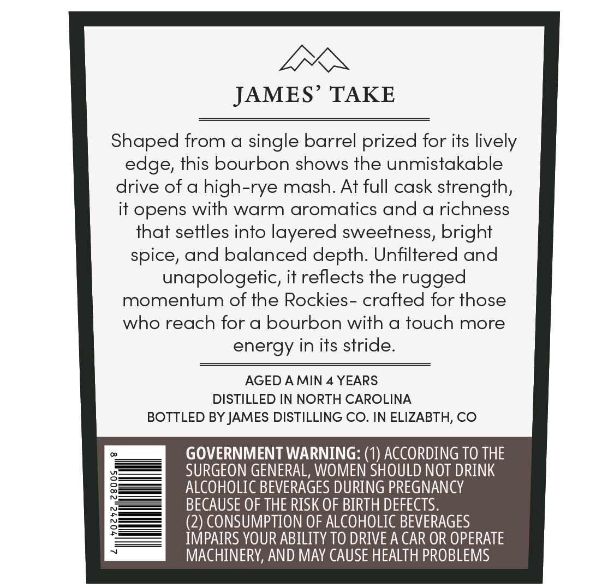
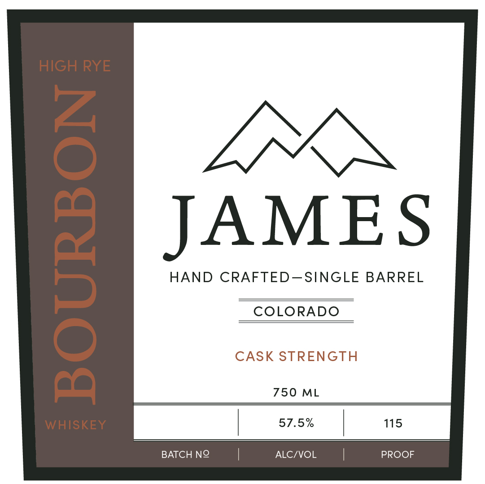

# TTB COLA Label Images - TTBID 26043001000552

**Brand Name:** JAMES

**Issue Date:** 02/25/2026

**Origin Code:** 13

**Product Class/Type:** 141

**Source:** [TTB Public COLA Registry](https://ttbonline.gov/colasonline/viewColaDetails.do?action=publicFormDisplay&ttbid=26043001000552)

## Label Images

### Back Label

### Front Label

## Extracted Label Text

*Text extracted via OCR - may contain errors*

**Detected Proof:** 115
**Detected Age:** 4 Years

### Back Label

LEX

JAMES’ TAKE

Shaped from a single barrel prized for its lively

edge, this bourbon shows the unmistakable

drive of a high-rye mash. At full cask strength,

it opens with warm aromatics and a richness

that settles into layered sweetness, bright

spice, and balanced depth. Unfiltered and

unapologetic, it reflects the rugged

momentum of the Rockies- crafted for those

who reach for a bourbon with a touch more

energy in its stride.

AGED AMIN 4 YEARS

DISTILLED IN NORTH CAROLINA

BOTTLED BY JAMES DISTILLING CO. IN ELIZABTH, CO

GOVERNMENT WARNING: (1) ACCORDING TO THE

ALCOHOLIC BEVERAGES DURING PREGNANCY

SURGEON GENERAL, WOMEN SHOULD NOT DRINK

BECAUSE OF THE RISK OF BIRTH DEFECTS.

(2) CONSUMPTION OF ALCOHOLIC BEVERAGES

IMPAIRS YOUR ABILITY TO DRIVE A CAR OR OPERATE

MACHINERY, AND MAY CAUSE HEALTH PROBLEMS

### Front Label

JAMES

HAND CRAFTED—SINGLE BARREL

COLORADO

CASK STRENGTH

750 ML

57.5%

BATCH NO ALC/VOL
