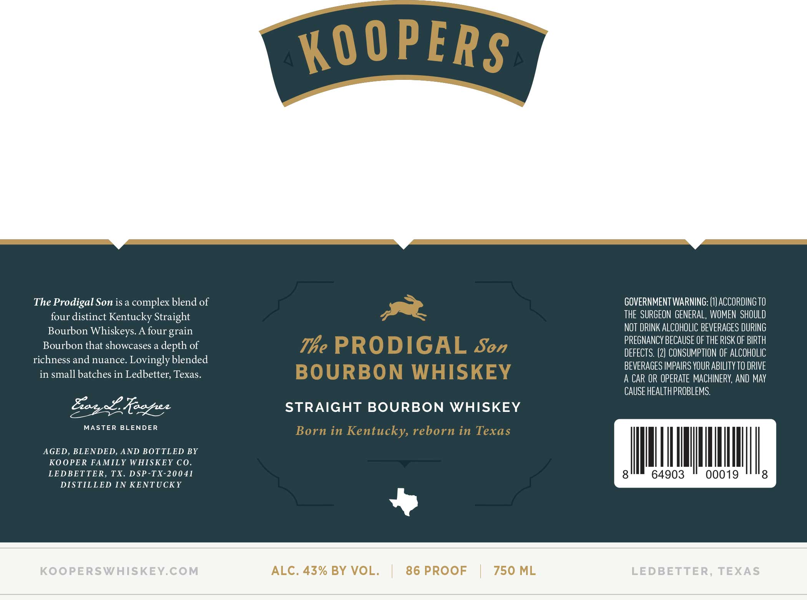
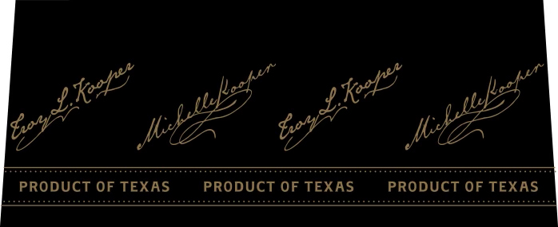

# TTB COLA Label Images - TTBID 26043001000581

**Brand Name:** THE PRODIGAL SON BOURBON WHISKEY

**Issue Date:** 02/13/2026

**Origin Code:** 44

**Product Class/Type:** 101

**Source:** [TTB Public COLA Registry](https://ttbonline.gov/colasonline/viewColaDetails.do?action=publicFormDisplay&ttbid=26043001000581)

## Label Images

### Label 1

### Label 2

## Extracted Label Text

*Text extracted via OCR - may contain errors*

### Label 1

The Prodigal Son is a complex blend of
four distinct Kentucky Straight
Bourbon Whiskeys. A four grain
Bourbon that showcases a depth of
richness and nuance. Lovingly blended
in small batches in Ledbetter, Texas.

Fags foegee

MASTER BLENDER

AGED, BLENDED, AND BOTTLED BY
KOOPER FAMILY WHISKEY CO.
LEDBETTER, TX. DSP-TX-20041

DISTILLED IN KENTUCKY

STRAIGHT BOURBON WHISKEY

ALC. 43% BY VOL.

~

86 PROOF

750 ML

GOVERNMENT WARNING: (1) ACCORDING T0
THE SURGEON GENERAL, WOMEN SHOULD
NOT DRINK ALCOHOLIC BEVERAGES DURING
PREGNANCY BECAUSE OF THE RISK OF BIRTH
DEFECTS. (2) CONSUMPTION OF ALCOHOLIC
BEVERAGES IMPAIRS YOUR ABILITY 10 DRIVE
A CAR OR OPERATE MACHINERY, AND MAY
CAUSE HEALTH PROBLEMS.

64903 " 00019 ""8

### Label 2

ca a cee

a pA a iam

i i Me Za
PRODUCT OF TEXAS PRODUCT OF TEXAS PRODUCT OF TEXAS
