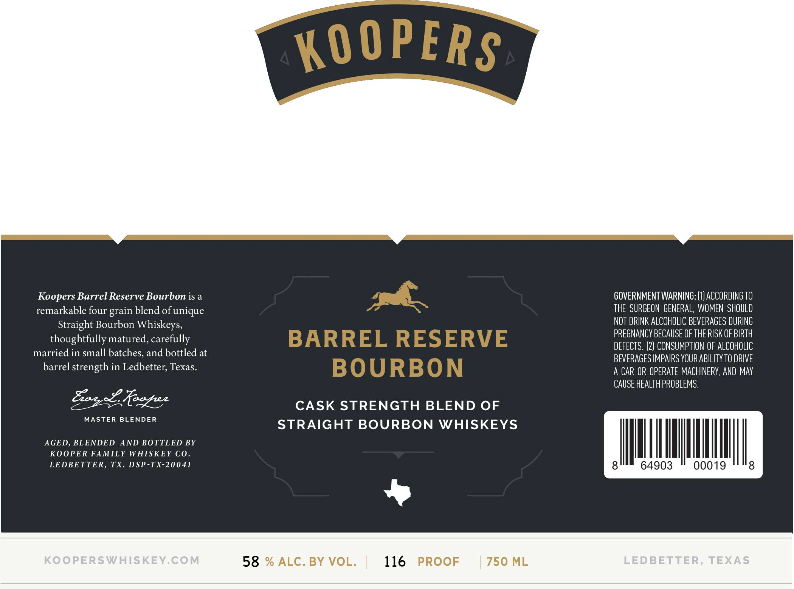

# TTB COLA Label Images - TTBID 26043001000587

**Brand Name:** BARREL RESERVE BOURBON

**Issue Date:** 02/17/2026

**Origin Code:** 44

**Product Class/Type:** 121

**Source:** [TTB Public COLA Registry](https://ttbonline.gov/colasonline/viewColaDetails.do?action=publicFormDisplay&ttbid=26043001000587)

## Label Images

### Label 1

### Label 2

## Extracted Label Text

*Text extracted via OCR - may contain errors*

### Label 1

Koopers Barrel Reserve Bourbon is a

GOVERNMENT WARNING: (1} ACCORDING T0

THE SURGEON GENERAL, WOMEN SHOULD

remarkable four grain blend of unique

Straight Bourbon Whiskeys,

NOT DRINK ALCOHOLIC BEVERAGES DURING

PREGNANCY BECAUSE OF THE RISK OF BIRTH

thoughtfully matured, carefully

DEFECTS. (2) CONSUMPTION OF ALCOHOLIC

married in small batches, and bottled at

BEVERAGES IMPAIRS YOUR ABILITY TO DRIVE

barrel strength in Ledbetter, Texas.

A CAR OR OPERATE MACHINERY, AND MAY

CAUSE HEALTH PROBLEMS.

BEE

CASK STRENGTH BLEND OF

MASTER BLENDER

STRAIGHT BOURBON WHISKEYS

AGED, BLENDED AND BOTTLED BY

KOOPER FAMILY WHISKEY CO.

|

|

l

LEDBETTER, TX. DSP-TX-20041

Ml

64903

0019

8

»

58 % ALC. BY VOL.

116 PROOF

750 ML

### Label 2

ye

Ne,

t ey”

Ml

wy

PRODUCT OF TEXAS

PRODUCT OF TEXAS

PRODUCT OF TEXAS
