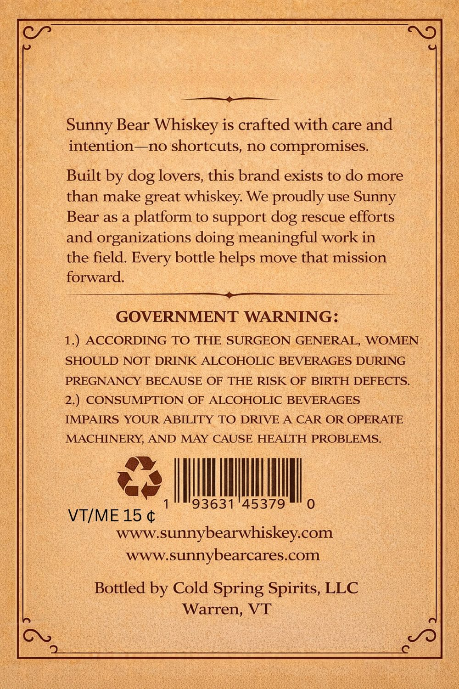
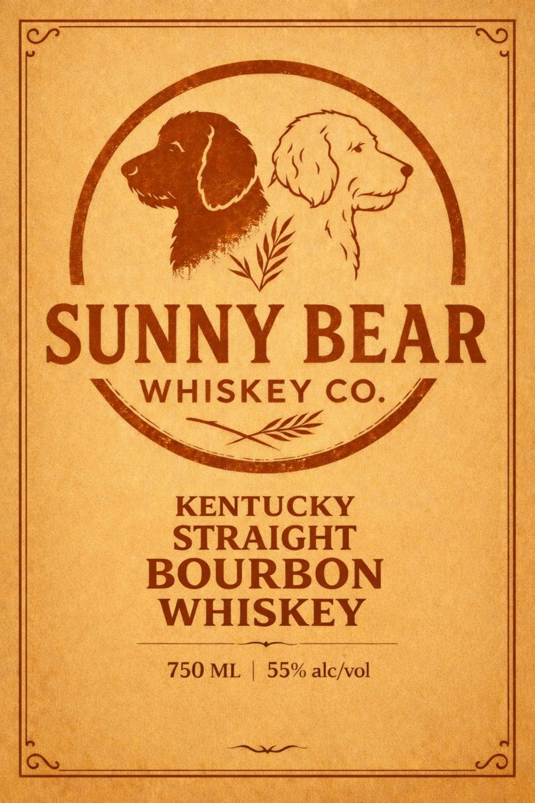

# TTB COLA Label Images - TTBID 26043001000621

**Brand Name:** SUNNY BEAR WHISKEY CO.

**Issue Date:** 02/13/2026

**Origin Code:** 46

**Product Class/Type:** 101

**Source:** [TTB Public COLA Registry](https://ttbonline.gov/colasonline/viewColaDetails.do?action=publicFormDisplay&ttbid=26043001000621)

## Label Images

### Back Label

### Front Label

## Extracted Label Text

*Text extracted via OCR - may contain errors*

### Back Label

—————_¢———_——_

Sunny Bear Whiskey is crafted with care and

intention—no shor tcuts, no compromises

Built by dog lovers, this brand exists to do more

than make great whiskey. We proudly use Sunny

Bear as a platform to support dog rescue efforts

and organizations doing meaningful work in

the field. Every bottle helps move that mission

forward.

a

GOVERNMENT WARNING:

1.) ACCORDING TO THE SURGEON GENERAL, WOMEN

SHOULD NOT DRINK ALCOHOLIC BEVERAGES DURING

PREGNANCY BECAUSE OF THE RISK OF BIRTH DEFECTS.

2.) CONSUMPTION OF ALCOHOLIC BEVERAGES

IMPAIRS YOUR ABILITY TO DRIVE A CAR OR OPERATE

MACHINERY, AND MAY CAUSE HEALTH PROBLEMS

os

me

|

IM

I

,

3631

45379

VT/ME 15 ¢

www.sunnybearwhiskey.com

Www. sunnybear Cares.com

Bottled by Cold Spring Spirits, LLC

Warren, VT

### Front Label

rel

Me

SUNNY BEAR

A NHISKEY CO.)

KENTUCKY

STRAIGHT

BOURBON

WHISKEY

750 ML | 55% alc/vol
