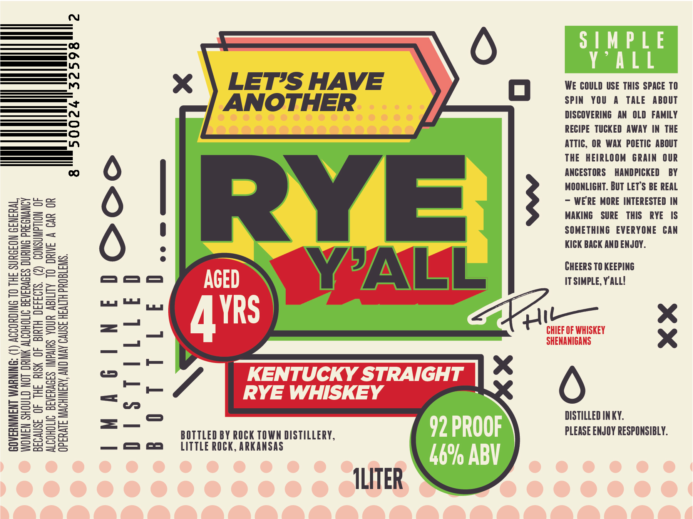

# TTB COLA Label Images - TTBID 26043001000839

**Brand Name:** RYE Y'ALL

**Issue Date:** 02/13/2026

**Origin Code:** 12

**Product Class/Type:** 102

**Source:** [TTB Public COLA Registry](https://ttbonline.gov/colasonline/viewColaDetails.do?action=publicFormDisplay&ttbid=26043001000839)

## Label Images

### Label 1

## Extracted Label Text

*Text extracted via OCR - may contain errors*

### Label 1

WOMEN SHOULD NOT DRINK ALCOHOLIC BEVERAGES DURING PREGNANCY
BECAUSE OF THE RISK OF BIRTH DEFECTS. (2) CONSUMPTION OF
ALCOHOLIC BEVERAGES IMPAIRS YOUR ABILITY 10 DRIVE A CAR OR

GOVERNMENT WARNING: (1) ACCORDING TO THE SURGEON GENERAL,
OPERATE MACHINERY, AND MAY CAUSE HEALTH PROBLEMS.

WE COULD USE THIS SPACE TO
SPIN YOU A TALE ABOUT
DISCOVERING AN OLD FAMILY
RECIPE TUCKED AWAY IN THE
ATTIC, OR WAX POETIC ABOUT
THE HEIRLOOM GRAIN OUR
ANCESTORS HANDPICKED BY
MOONLIGHT. BUT LET'S BE REAL
— WE'RE MORE INTERESTED IN
MAKING SURE THIS RYE IS
SOMETHING EVERYONE CAN

KICK BACK AND ENJOY.
CHEERS TO KEEPING
aa ae ITSIMPLE, Y'ALL!
ma ee
- Pi— xe
Zz —I CHIEF OF WHISKEY
= SHENANIGANS x
—
i —}
is — —
i)
=_° DISTILLED INKY.

BOTTLED BY ROCK TOWN DISTILLERY, PLEASE ENJOY RESPONSIBLY.

ae ES 8 CCL ITTLE ROCK, ARKANSAS

TLITER
