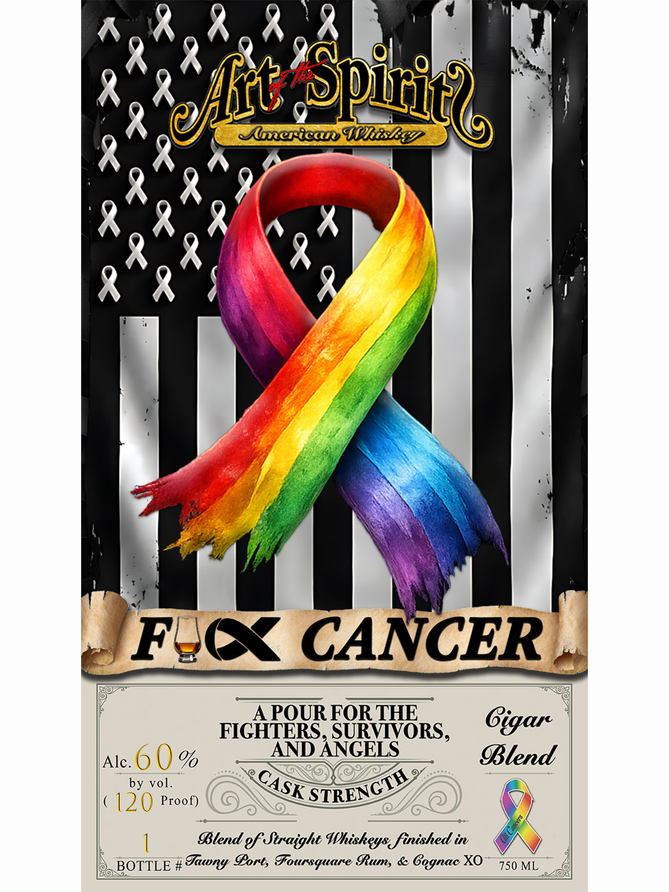

# TTB COLA Label Images - TTBID 26043001000930

**Brand Name:** ART OF THE SPIRITS AMERICAN WHISKEY

**Fanciful Name:** F CANCER

**Issue Date:** 02/17/2026

**Origin Code:** 13

**Product Class/Type:** 129

**Source:** [TTB Public COLA Registry](https://ttbonline.gov/colasonline/viewColaDetails.do?action=publicFormDisplay&ttbid=26043001000930)

## Label Images

### Front Label

## Extracted Label Text

*Text extracted via OCR - may contain errors*

### Front Label

AOR RAK

KR

Ql! g

RR

A

Dy

RAOA

RR

RR

RR

RR)

we

‘

¢) FeQk CANCER ,,

A POUR FOR THE

Cigar

Blend

Alc.) %

by vol.

Ge 0) i)

SSK TREC

y/

l

Blend of Straight Whisheys, finished in

), BOTTLE # Tawny Port, Foursquare Rum, & Cognac XO~ 759 v1,
