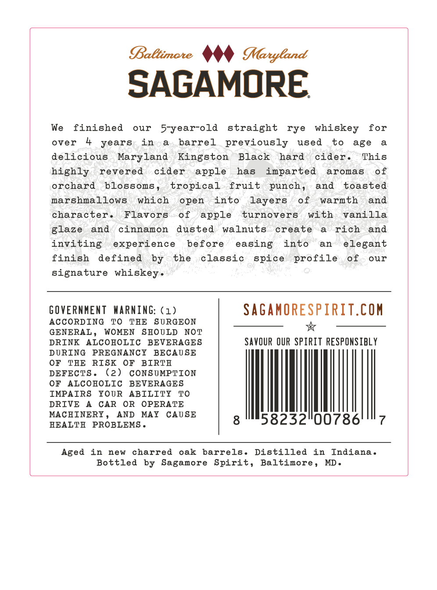
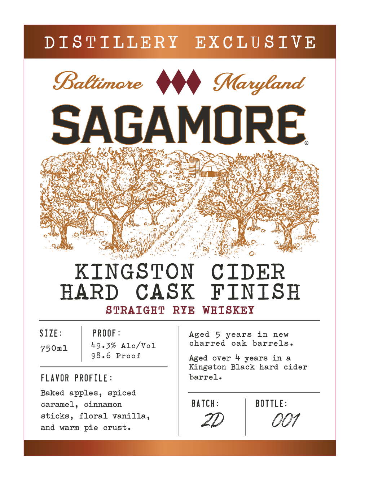

# TTB COLA Label Images - TTBID 26044001000267

**Brand Name:** SAGAMORE

**Fanciful Name:** KINGSTON CIDER HARD CASK FINISH

**Issue Date:** 02/13/2026

**Origin Code:** 25

**Product Class/Type:** 102

**Source:** [TTB Public COLA Registry](https://ttbonline.gov/colasonline/viewColaDetails.do?action=publicFormDisplay&ttbid=26044001000267)

## Label Images

### Back Label

### Front Label

## Extracted Label Text

*Text extracted via OCR - may contain errors*

### Back Label

SAGAMORE
We finished our 5-year-old straight rye whiskey for
over 4 years in a barrel previously used to age a
delicious Maryland Kingston Black hard cider. This
highly revered cider apple has imparted aromas of
orchard blossoms, tropical fruit punch, and toasted
marshmallows which open into layers of warmth and
character. Flavors of apple turnovers with vanilla
glaze and cinnamon dusted walnuts create a rich and
inviting experience before easing into an elegant
finish defined by the classic spice profile of our
signature whiskey.
GOVERNMENT WARNING: (1) SAGAMORESPIRIT.COM
ACCORDING TO THE SURGEON *&
GENERAL, WOMEN SHOULD NOT
DRINK ALCOHOLIC BEVERAGES SAVOUR OUR SPIRIT RESPONSIBLY
DURING PREGNANCY BECAUSE
OF THE RISK OF BIRTH
DEFECTS. (2) CONSUMPTION
OF ALCOHOLIC BEVERAGES
IMPAIRS YOUR ABILITY TO
DRIVE A CAR OR OPERATE
MACHINERY, AND MAY CAUSE
HEALTH PROBLEMS. 8 98232°00786'"7
Aged in new charred oak barrels. Distilled in Indiana.
Bottled by Sagamore Spirit, Baltimore, MD.

### Front Label

SAGAMO RE

afer y ee

i

Gas

th Kf de

is

Se is

es

:

(a

ees

Ps

G,

ha

}

og

An

ima ,

KINGSTON CIDER

HARD CASK FINISH

STRAIGHT RYE WHISKEY

SIZE

PROOF

Aged 5 years in new

750ml

49.3% Alc/Vol

charred oak barrels

8.6 Proof

Aged over 4 years ina

Kingston Black hard cider

FLAVOR PROFILE

barrel

Baked apples, spiced

caramel, cinnamon

BATCH

BOTTLE

sticks, floral vanilla,

and warm pie crust

2D

007

ESE EZ
