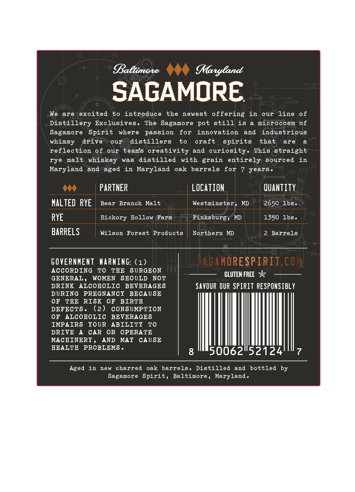
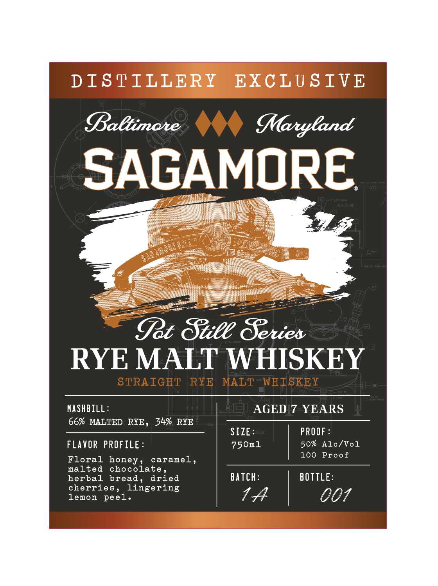

# TTB COLA Label Images - TTBID 26044001000271

**Brand Name:** SAGAMORE

**Fanciful Name:** POT STILL SERIES RYE MALT WHISKEY

**Issue Date:** 02/13/2026

**Origin Code:** 25

**Product Class/Type:** 109

**Source:** [TTB Public COLA Registry](https://ttbonline.gov/colasonline/viewColaDetails.do?action=publicFormDisplay&ttbid=26044001000271)

## Label Images

### Back Label

### Label 1

## Extracted Label Text

*Text extracted via OCR - may contain errors*

### Back Label

SAGAMORE.

We are excited to introduce the newest offering in our line of

Distillery Exclusives. The Sagamore pot still is a microcosm of

Sagamore Spirit where passion for innovation and industrious

whimsy drive

our distillers

to

craft

spirits

that

are

a

reflection of our teams creativity and curiosity. This straight

rye malt whiskey was distilled with grain entirely sourced in

Maryland and aged in Maryland oak barrels for 7 years.

404

PARTNER

_

LOCATION

QUANTITY

MALTED RYE

Bear Branch Malt

Westminster, MD

2650 lbs.

-

J

f

RYE

Hickory Hollow Farm

Finksburg; MD

1350 lbs.

BARRE!

Wilson Forest Products

Northern MD

2 Barrels

GOVERNMENT WARNING: (1)

AMORESPIRIT.

ACCORDING TO THE SURGEON

GLUTEN FREE 3x

GENERAL, WOMEN SHOULD NOT

DRINK ALCOHOLIC BEVERAGES

SAVOUR OUR SPIRIT RESPONSIBLY

DURING PREGNANCY BECAUSE

OF THE RISK OF BIRTH

DEFECTS.

(2)

CONSUMPTION

OF ALCOHOLIC BEVERAGES

IMPAIRS YOUR ABILITY TO

DRIVE A CAR OR OPERATE

MACHINERY,

AND MAY CAUSE

HEALTH PROBLEMS.

AIM

7

Aged in new charred oak barrels. Distilled and bottled by

Sagamore Spirit, Baltimore, Maryland.

### Label 1

Dal

SAGAMORE

—

Cpe Sule Beries

RYE MALT WHISKEY

STRAIGHT

RYE MALT

WHISKEY

MASHBILL:

AGED 7 YEARS

66% MALTED RYE, 34% RYE

SIZE:

PROOF:

FLAVOR PROFILE:

750m1

50% Alc/Vol

Floral honey, caramel,

|

100 Proof

malted chocolate,

herbal bread, dried

cherries, lingering

BATCH:

BOTTLE:

lemon peel.

7A

O07

|
