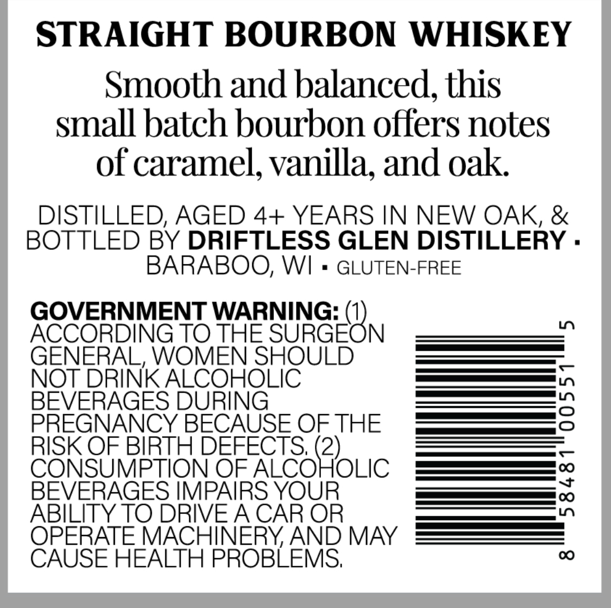
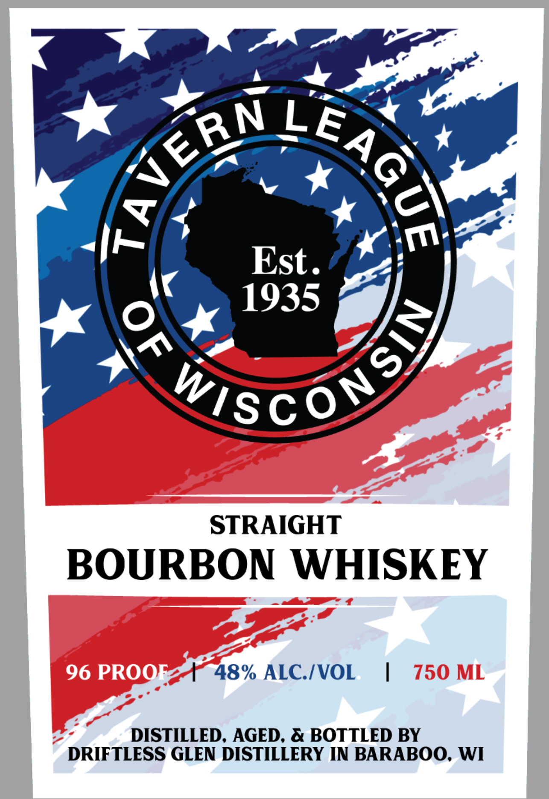

# TTB COLA Label Images - TTBID 26044001000358

**Brand Name:** TAVERN LEAGUE OF WISCONSIN

**Issue Date:** 02/13/2026

**Origin Code:** 48

**Product Class/Type:** 101

**Source:** [TTB Public COLA Registry](https://ttbonline.gov/colasonline/viewColaDetails.do?action=publicFormDisplay&ttbid=26044001000358)

## Label Images

### Back Label

### Front Label

## Extracted Label Text

*Text extracted via OCR - may contain errors*

### Back Label

STRAIGHT BOURBON WHISKEY

Smooth and balanced, this

small batch bourbon offers notes

of caramel, vanilla, and oak

DISTILLED, AGED 4+ YEARS IN NEW OAK, &

BOTTLED BY DRIFTLESS GLEN DISTILLERY

BARABOO, WI

GLUTEN-FREE

GOVERNMENT WARNING: (

ACCORDING TO THE NURGEC N

GENERAL, WOMEN SHOULD

NOT

INK Sontit aa

es |,

EVERAGE

a |

PREGNANCY E BECAUSE OF THE

Ee —

Se —

RISK OF BIRTH DEF

S, (2)

C

|

OF ALCO

OLIC

[—_$__[ve

BEVERAGES IMP,

re OC)

ABILITY TO DRIV

O

T

HINERY, AND MAY

CAUSE HEALTH PROBLEMS

### Front Label

STRAIGHT

BOURBON WHISKEY

48% ALC./VOL_ |

DISTILLED, AGED, & BOTTLED BY
DRIFTLESS GLEN DISTILLERY IN BARABOO, WI
