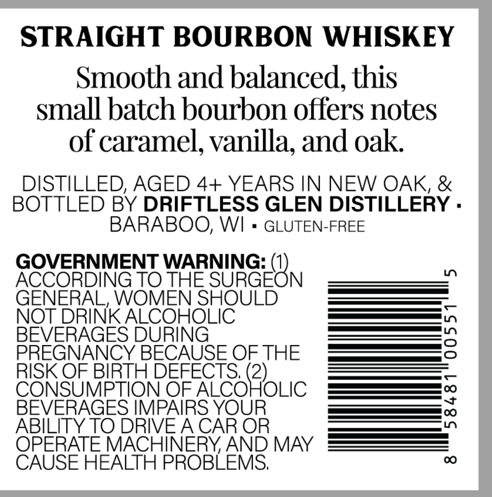
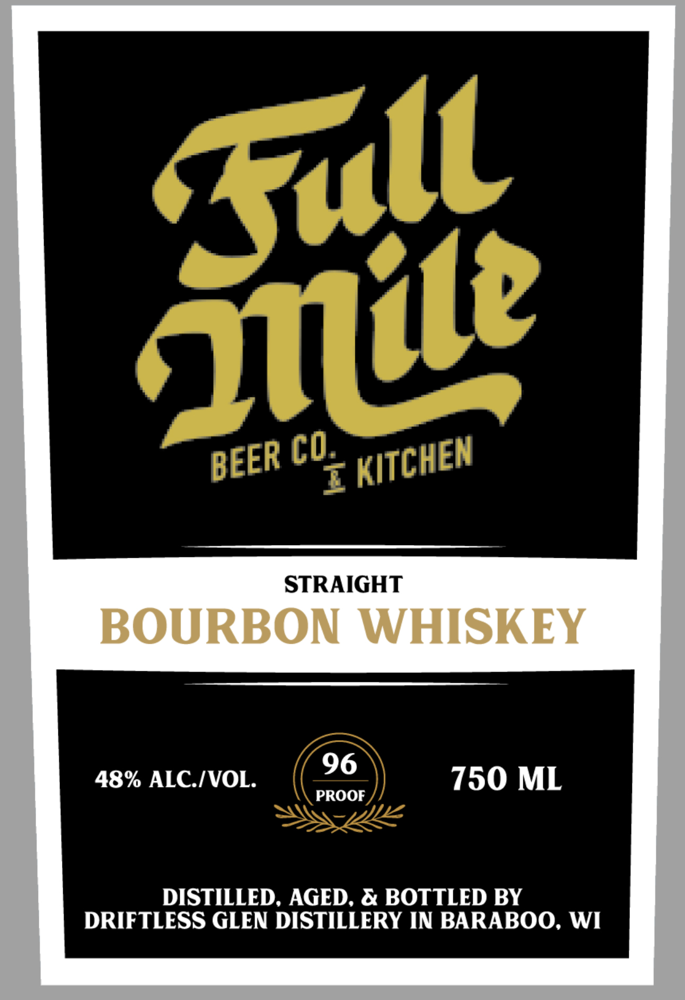

# TTB COLA Label Images - TTBID 26044001000368

**Brand Name:** FULL MILE BEER CO. & KITCHEN

**Issue Date:** 02/13/2026

**Origin Code:** 48

**Product Class/Type:** 101

**Source:** [TTB Public COLA Registry](https://ttbonline.gov/colasonline/viewColaDetails.do?action=publicFormDisplay&ttbid=26044001000368)

## Label Images

### Back Label

### Front Label

## Extracted Label Text

*Text extracted via OCR - may contain errors*

### Back Label

STRAIGHT BOURBON WHISKEY

Smooth and balanced, this

small batch bourbon offers notes

of caramel, vanilla, and oak

DISTILLED, AGED 4+ YEARS IN NEW OAK, &

BOTTLED BY DRIFTLESS GLEN DISTILLERY

BARABOO, WI

GLUTEN-FREE

GOVERNMENT WARNING: (

ACCORDING TO THE NURGEC N

GENERAL, WOMEN SHOULD

NOT

INK SBIR

|

es |

EVERAGES D

ee —

PREGNANCY BECAUSE OF THE

— —

C

RISK OF BIRTH DEF

|

OF ALCO

S. (2)

OLIC

[—_[ve]

BEVERAGES IMP,

rr OK)

ABILITY TO DRIV

O

TE

HINERY, AND MAY

CAUSE HEALTH PROBLEMS

### Front Label

STRAIGHT

BOURBON WHISKEY

96

48% ALC./VOL.

PROOF

750 ML

DISTILLED, AGED, & BOTTLED BY

DRIFTLESS GLEN DISTILLERY IN BARABOO, WI
