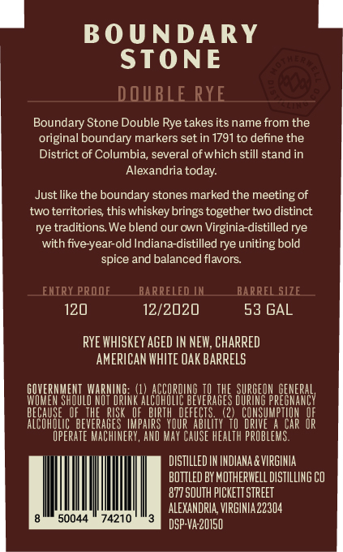
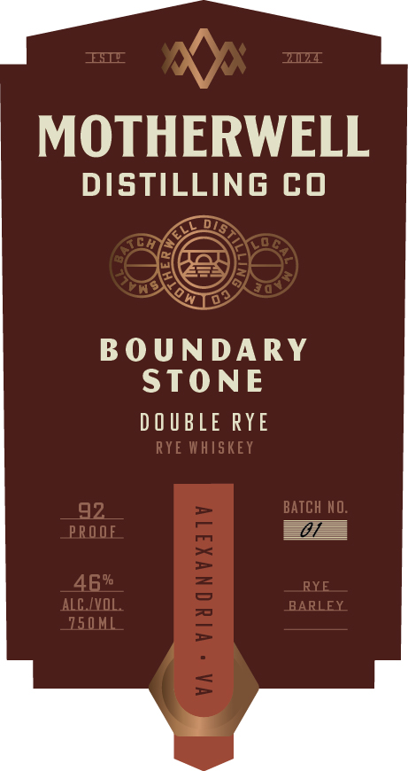
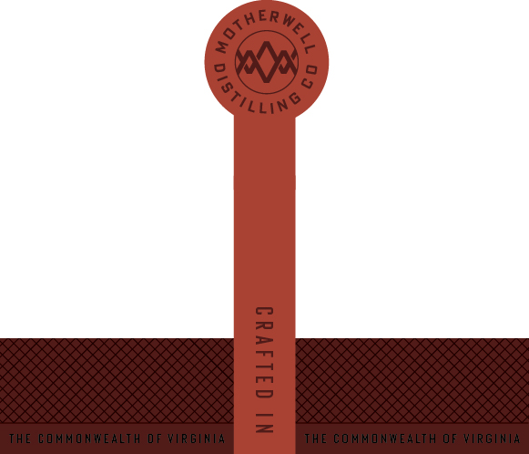

# TTB COLA Label Images - TTBID 26044001000394

**Brand Name:** BOUNDARY STONE DOUBLE RYE

**Issue Date:** 02/20/2026

**Origin Code:** 05

**Product Class/Type:** 142

**Source:** [TTB Public COLA Registry](https://ttbonline.gov/colasonline/viewColaDetails.do?action=publicFormDisplay&ttbid=26044001000394)

## Label Images

### Back Label

### Front Label

### Label 2

## Extracted Label Text

*Text extracted via OCR - may contain errors*

*1 image(s) excluded: text did not meet readability threshold*

### Back Label

DOUBLE RYE
Boundary Stone Double Rye takes its name from the
original boundary markers set in 1791 to define the
District of Columbia, several of which still stand in
Alexandria today.

Just like the boundary stones marked the meeting of
two territories, this whiskey brings together two distinct
rye traditions. We blend our own Virginia-distilled rye
with five-year-old Indiana-distilled rye uniting bold
spice and balanced flavors.

120 12/2020 53 GAL
RYE WHISKEY AGED IN NEW, CHARRED
AMERICAN WHITE OAK BARRELS
GOVERNMENT WARNING: (1) ACCORDING T0 THE SURGEON GENERAL
WOMEN SHOULD NOT DRINK ALCOMDLIC BEVERAGES DURING PREGNANEY
BECAUSE OF THE RISK OF BIRTH DEFECTS. (2) CONSUMPTION OF
ALCOHOLIC BEVERAGES IMPAIRS YOUR ABILITY TD DRIVE A CAR OR
OPERATE MACHINERY, AND MAY CAUSE HEALTR PROBLEMS.
DISTILLED IN INDIANA &VIRGINIA
BOTTLED BY NOTHERWELLDISTLLING CO
77 SOUTH PICKETT STREET
ALEXANDRIA VIRGINIA22304
8 50044 © 74210 "3 DSP-VA-20150

### Front Label

x)
MOTHERWELL

DISTILLING CO

BOUNDARY
STONE

DOUBLE RYE
