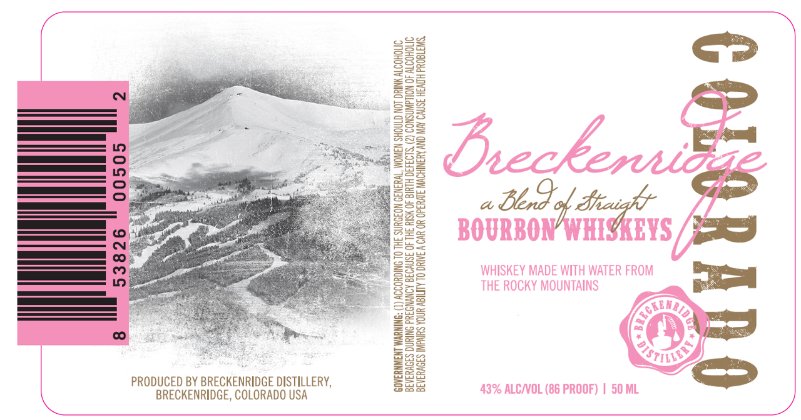

# TTB COLA Label Images - TTBID 26044001000617

**Brand Name:** BRECKENRIDGE

**Issue Date:** 02/26/2026

**Origin Code:** 13

**Product Class/Type:** 121

**Source:** [TTB Public COLA Registry](https://ttbonline.gov/colasonline/viewColaDetails.do?action=publicFormDisplay&ttbid=26044001000617)

## Label Images

### Label 1

## Extracted Label Text

*Text extracted via OCR - may contain errors*

### Label 1

eg

See

Ssq

Sse

B82

San

2E=

S32

222

=s5

ss

Say

BS

Ea

B25

252

S33

=)

B88

BS

s2Z

Bae

So

Se

roe

eZ

a

ZS

Eo

EE ©

=

Rit

BS

Bs

ee

Jas

——C

=

Zea

S=E=

“aida

Sse

pa

C=

Ss

so

Ba

o,

oes

toe

a Berd o dah

—]

gos

foetre)

SS

—_ CO

S83

ese

25

Bae

58s

22s

35

335

nicks

Esa

srs

Bee

225

Vinod

SS

eae

2S3

Baa

2a

S55

==

222

PRODUCED BY BRECKENRIDGE DISTILLERY,

Bas

Bag

BRECKENRIDGE, COLORADO USA
