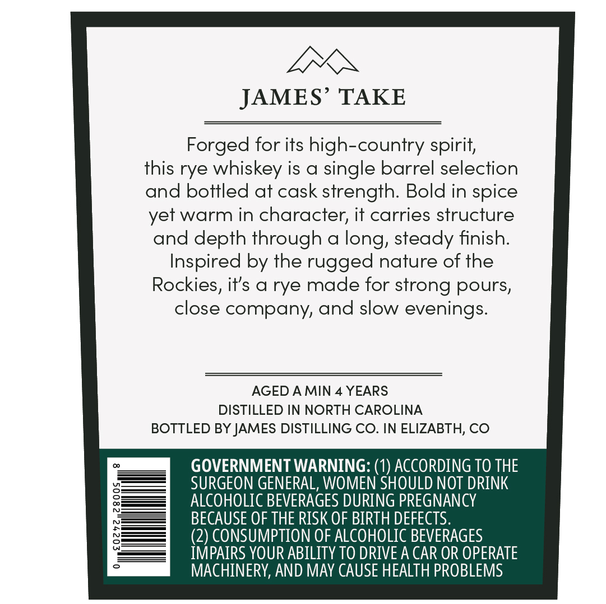
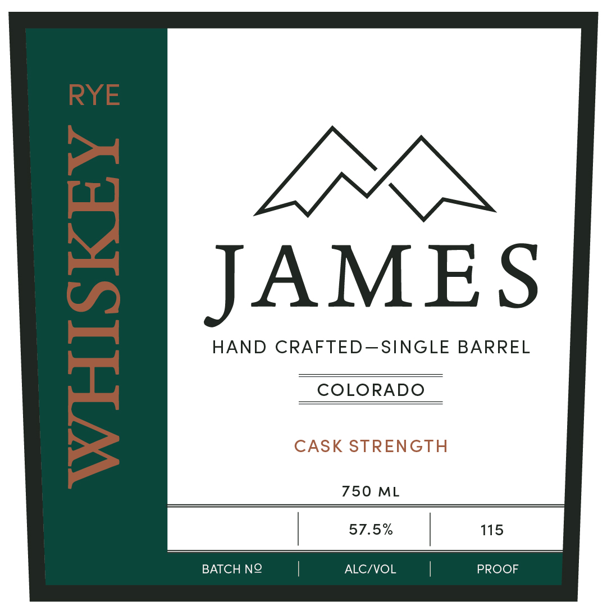

# TTB COLA Label Images - TTBID 26044001000702

**Brand Name:** JAMES

**Issue Date:** 02/25/2026

**Origin Code:** 13

**Product Class/Type:** 142

**Source:** [TTB Public COLA Registry](https://ttbonline.gov/colasonline/viewColaDetails.do?action=publicFormDisplay&ttbid=26044001000702)

## Label Images

### Back Label

### Front Label

## Extracted Label Text

*Text extracted via OCR - may contain errors*

**Detected Proof:** 115
**Detected Age:** 4 Years

### Back Label

LEX

JAMES’ TAKE

Forged for its high-country spirit,

this rye whiskey is a single barrel selection

and bottled at cask strength. Bold in spice

yet warm in character, it carries structur:

and depth through a long, steady finish.

Inspired by the rugged nature of th

Rockies, it’s a rye made for strong pours,

close company, and slow evenings.

AGED AMIN 4 YEARS

DISTILLED IN NORTH CAROLINA

BOTTLED BY JAMES DISTILLING CO. IN ELIZABTH, CO

GOVERNMENT WARNING: (1) ACCORDING TO THE

ALCOHOLIC BEVERAGES DURING PREGNANCY

SURGEON GENERAL, WOMEN SHOULD NOT DRINK

BECAUSE OF THE RISK OF BIRTH DEFECTS.

(2) CONSUMPTION OF ALCOHOLIC BEVERAGES

IMPAIRS YOUR ABILITY TO DRIVE A CAR OR OPERATE

MACHINERY, AND MAY CAUSE HEALTH PROBLEMS

### Front Label

RYE

JAMES

HAND CRAFTED—SINGLE BARREL

COLORADO

750 ML

57.5%

115

BATCH NO

ALC/VOL

PROOF
