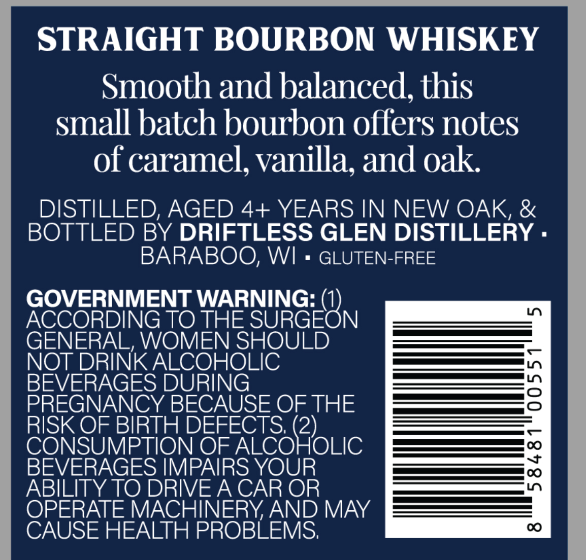
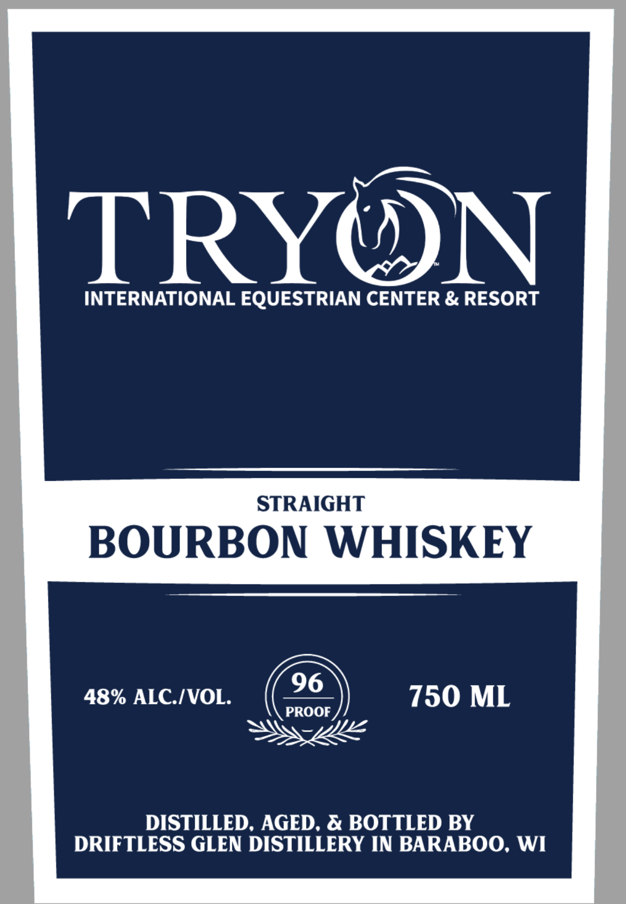

# TTB COLA Label Images - TTBID 26047001000039

**Brand Name:** TRYON

**Issue Date:** 02/20/2026

**Origin Code:** 48

**Product Class/Type:** 101

**Source:** [TTB Public COLA Registry](https://ttbonline.gov/colasonline/viewColaDetails.do?action=publicFormDisplay&ttbid=26047001000039)

## Label Images

### Back Label

### Front Label

## Extracted Label Text

*Text extracted via OCR - may contain errors*

### Back Label

STRAIGHT BOURBON WHISKEY
Smooth and balanced, this
small batch bourbon offers notes
of caramel, vanilla, and oak.
DISTILLED, AGED 4+ YEARS IN NEW OAK, &
BOTTLED BY DRIFTLESS GLEN DISTILLERY -
BARABOO, WI = GLUTEN-FREE

GOVERNMENT WARNING: 0}

ACCORDING TO THE SRRGEON —Z
GENERAL, WOMEN SHOULD —e
NOT DRINK ALCOHOLIC ——S+s
BEVERAGES DURING —-
PREGNANCY BECAUSE OF THE =-_——=53
RISK OF BIRTH DEFECTS, (2) —
CONSUMPTION OF ALCOHOLIC FEE
BEVERAGES IMPAIRS YOUR Ss
ABILITY TO DRIVE A CAR OR —————
OPERATE MACHINERY, AND MAY —=3
CAUSE HEALTH PROBLEMS, 00

### Front Label

INTERNATIONAL EQUESTRIAN CENTER & RESORT

STRAIGHT

BOURBON WHISKEY

48% ALC./VOL. (2s) 750 ML
pee Nw

DISTILLED, AGED, & BOTTLED BY
DRIFTLESS GLEN DISTILLERY IN BARABOO, WI
