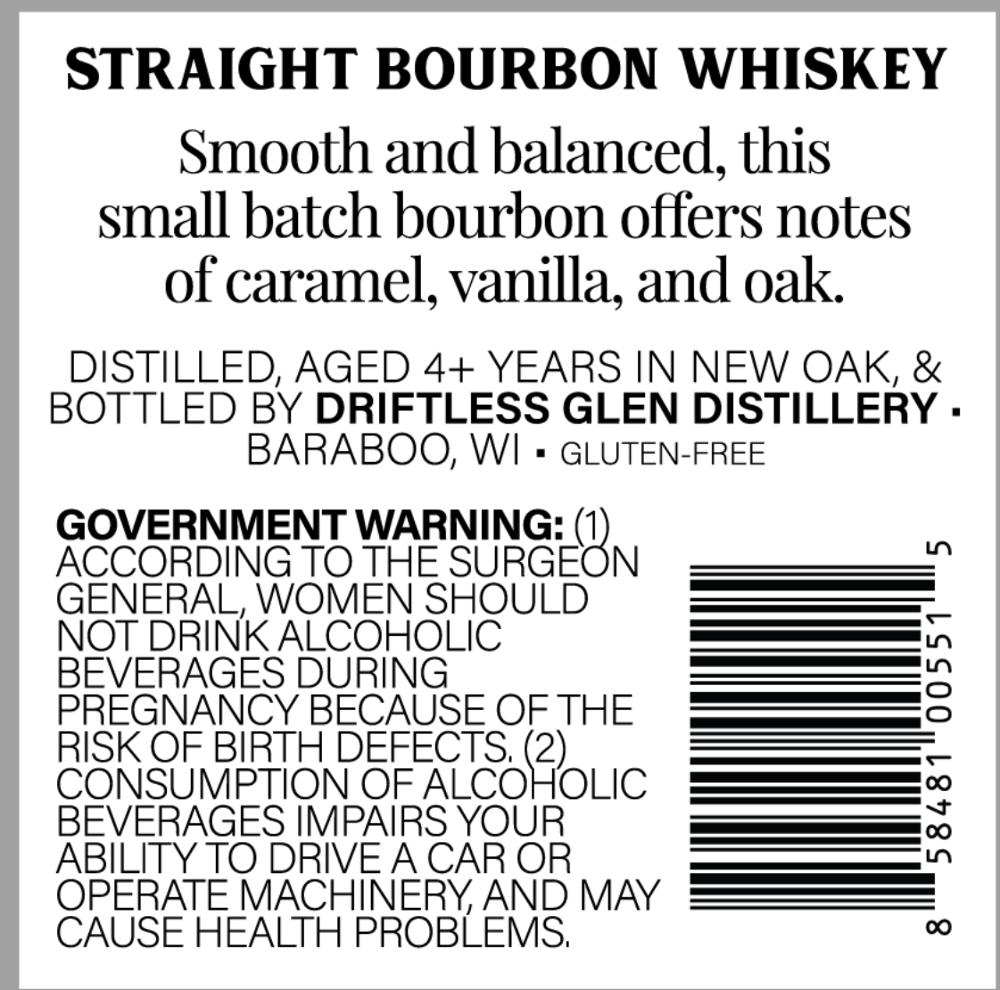
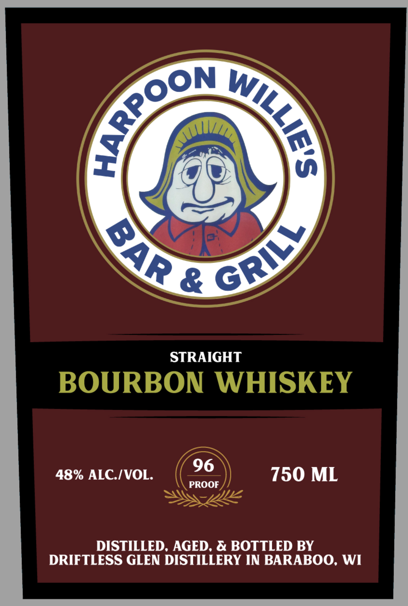

# TTB COLA Label Images - TTBID 26047001000056

**Brand Name:** HARPOON WILLIE'S BAR & GRILL

**Issue Date:** 02/18/2026

**Origin Code:** 48

**Product Class/Type:** 101

**Source:** [TTB Public COLA Registry](https://ttbonline.gov/colasonline/viewColaDetails.do?action=publicFormDisplay&ttbid=26047001000056)

## Label Images

### Back Label

### Front Label

## Extracted Label Text

*Text extracted via OCR - may contain errors*

### Back Label

STRAIGHT BOURBON WHISKEY

Smooth and balanced, this

small batch bourbon offers notes

of caramel, vanilla, and oak

DISTILLED, AGED 4+ YEARS IN NEW OAK, &

BOTTLED BY DRIFTLESS GLEN DISTILLERY

BARABOO, WI

GLUTEN-FREE

GOVERNMENT WARNING: (

ACCORDING TO ene SURGE N

NOT DRINK ALCONOUIC

es |

BEVERAGE

a —

ee |)

PREGNANCY E BECAUSE OF THE

— —

RISK OF BIRTH D

)

CONS

M

N OF ALCO

OLIC

[—_[ve]

BEVERAGES IMPA

re OC)

ABILITY TO DRIVE A CAR OR

CAUSE HEALTH PROBLEMS

OPERATE MACHINERY, AND MAY

### Front Label

{

\y

sayy

/*»

STRAIGHT

BOURBON WHISKEY

48% ALC./VOL. (36) 750 ML

—

DISTILLED, AGED, & BOTTLED BY

DRIFTLESS GLEN DISTILLERY IN BARABOO, WI
