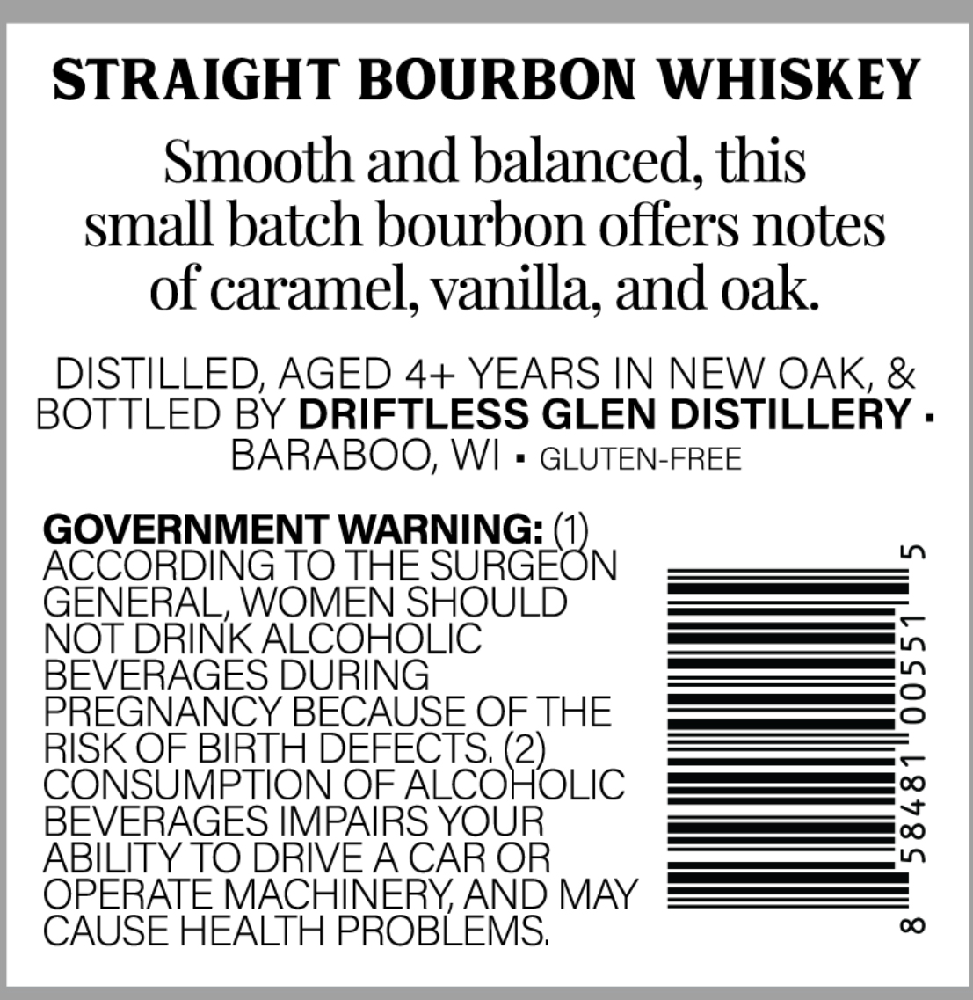
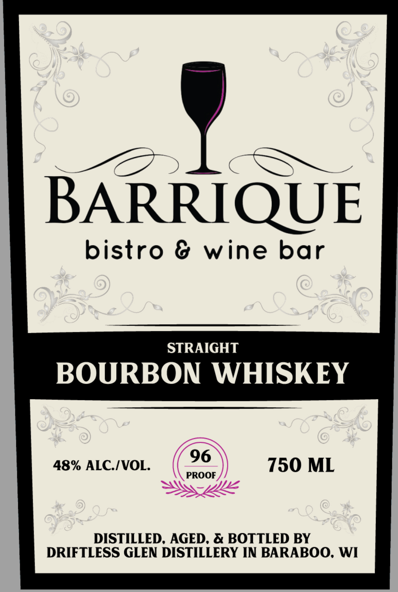

# TTB COLA Label Images - TTBID 26047001000060

**Brand Name:** BARRIQUE BISTRO & WINE BAR

**Issue Date:** 02/18/2026

**Origin Code:** 48

**Product Class/Type:** 101

**Source:** [TTB Public COLA Registry](https://ttbonline.gov/colasonline/viewColaDetails.do?action=publicFormDisplay&ttbid=26047001000060)

## Label Images

### Back Label

### Front Label

## Extracted Label Text

*Text extracted via OCR - may contain errors*

### Back Label

STRAIGHT BOURBON WHISKEY
Smooth and balanced, this
small batch bourbon offers notes
of caramel, vanilla, and oak.
DISTILLED, AGED 4+ YEARS IN NEW OAK, &
BOTTLED BY DRIFTLESS GLEN DISTILLERY -
BARABOO, WI = GLUTEN-FREE

GOVERNMENT WARNING: 0)

ACCORDING TO THE SURGEON ===______”
GENERAL, WOMEN SHOULDI_—_—=E=EE_
NOT DRINK ALCOHOLIC ——— |,
BEVERAGES DURING ———
PREGNANCY BECAUSE OF THE =Z=Z=Z=c
RISK OF BIRTH DEFECTS, 2) ————
CONSUMPTION OF ALCOHOLIC —=—=====00
BEVERAGES IMPAIRS YOUR ————
ABILITY TO DRIVE A CAR OR ———5
OPERATE MACHINERY, AND MY ——_—_=—==
CAUSE HEALTH PROBLEMS, 00

### Front Label

= mae ) SS y,

BARRIQUE

bistro & wine bar

STRAIGHT

BOURBON WHISKEY

48% ALC./VOL. 96 750 ML

PROOF

DISTILLED, AGED, & BOTTLED BY
DRIFTLESS GLEN DISTILLERY IN BARABOO, WI
