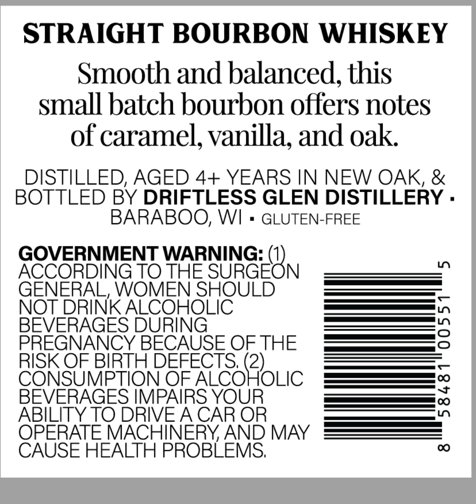
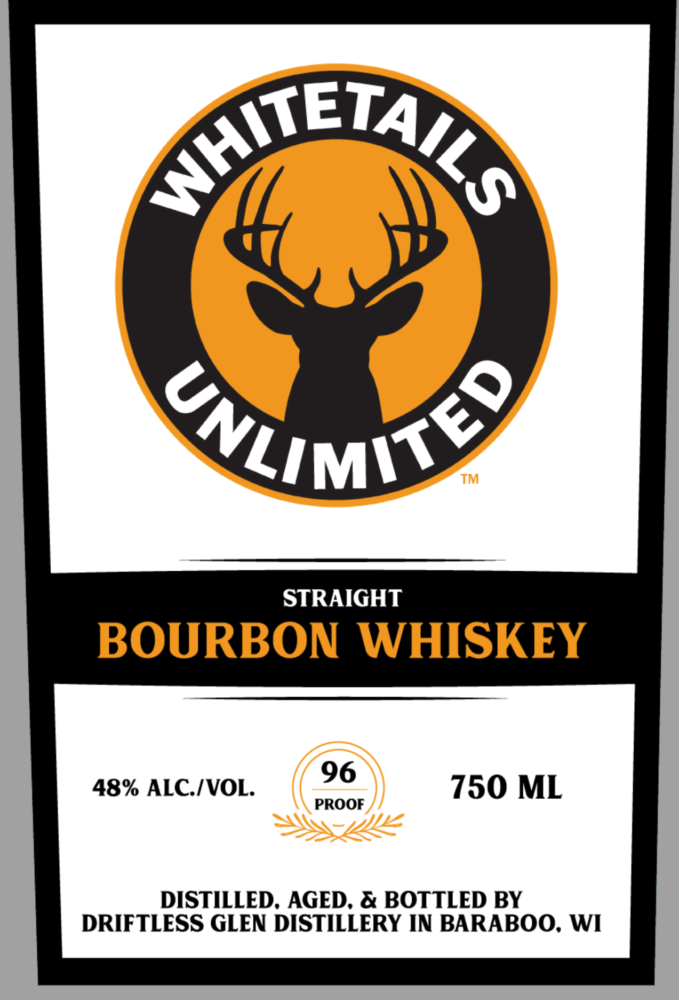

# TTB COLA Label Images - TTBID 26047001000067

**Brand Name:** WHITETAILS UNLIMITED

**Issue Date:** 02/18/2026

**Origin Code:** 48

**Product Class/Type:** 101

**Source:** [TTB Public COLA Registry](https://ttbonline.gov/colasonline/viewColaDetails.do?action=publicFormDisplay&ttbid=26047001000067)

## Label Images

### Back Label

### Front Label

## Extracted Label Text

*Text extracted via OCR - may contain errors*

### Back Label

STRAIGHT BOURBON WHISKEY

Smooth and balanced, this

small batch bourbon offers notes

of caramel, vanilla, and oak

DISTILLED, AGED 4+ YEARS IN NEW OAK, &

BOTTLED BY DRIFTLESS GLEN DISTILLERY

BARABOO, WI

GLUTEN-FREE

GOVERNMENT WARNING: (

ACCORDING TO ane SURGE N

NOT DRINK ALCONOUIC

ee |

es |,

BEVERAGE

ee —

RISK OF BIRTH D

PREGNANCY E BECAUSE OF THE

a  —

CONSUMP

N OF ALCO

)

OLIC

[_—_[ve]

BEVERAGES IMP,

re OC)

ABILITY TO DRIVE A CAR OR

OPERATE MACHINERY, AND MAY

CAUSE HEALTH PROBLEMS

### Front Label

TET4 y

Ky

A /

y

Say)

Zi

m\s

STRAIGHT

BOURBON WHISKEY

48% ALC./VOL.

PROOF

750 ML

DISTILLED, AGED, & BOTTLED BY

DRIFTLESS GLEN DISTILLERY IN BARABOO, WI
