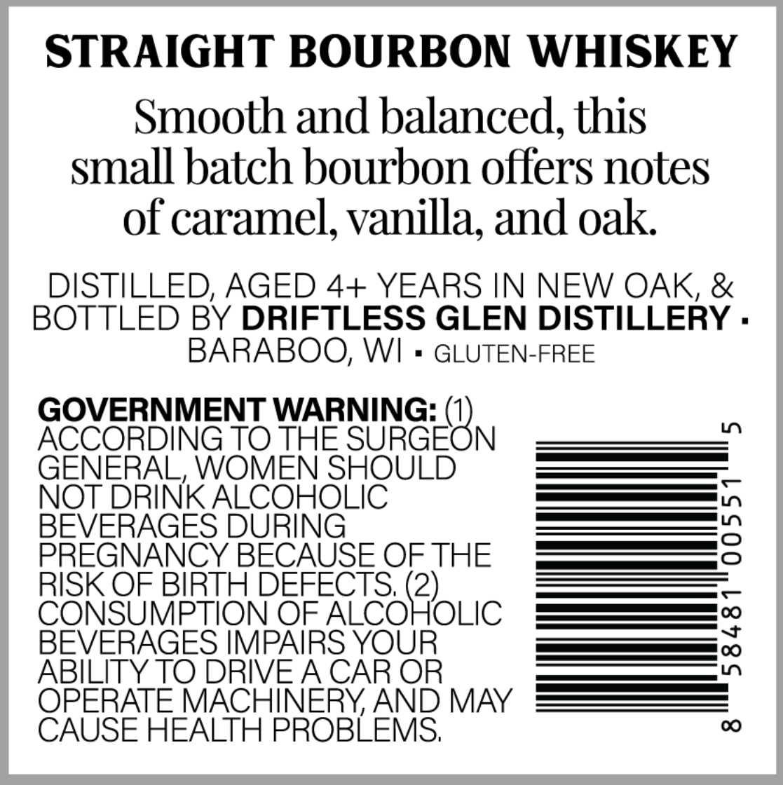

# TTB COLA Label Images - TTBID 26047001000078

**Brand Name:** RR

**Issue Date:** 02/18/2026

**Origin Code:** 48

**Product Class/Type:** 101

**Source:** [TTB Public COLA Registry](https://ttbonline.gov/colasonline/viewColaDetails.do?action=publicFormDisplay&ttbid=26047001000078)

## Label Images

### Back Label

## Extracted Label Text

*Text extracted via OCR - may contain errors*

### Back Label

STRAIGHT BOURBON WHISKEY

Smooth and balanced, this

small batch bourbon offers notes

of caramel, vanilla, and oak

DISTILLED, AGED 4+ YEARS IN NEW OAK, &

BOTTLED BY DRIFTLESS GLEN DISTILLERY

BARABOO, WI

GLUTEN-FREE

GOVERNMENT WARNING: (

ACCORDING TO THE NU RGEC N

GENERAL, WOMEN SHOULD

NOT

INK SOR

|)

es |,

BEVERAGE

SS  —

PREGNANCY E BECAUSE OF THE

a

C

RISK OF BIRTH DEFEC

5

OF ALCO

)

OLIC

[—__[ve]

B

ERAGES IMPAI

re OC)

ABILITY TO DRIV

ERAT

ACHINERY, AND MAY

CAUSE HEALTH PROBLEMS
