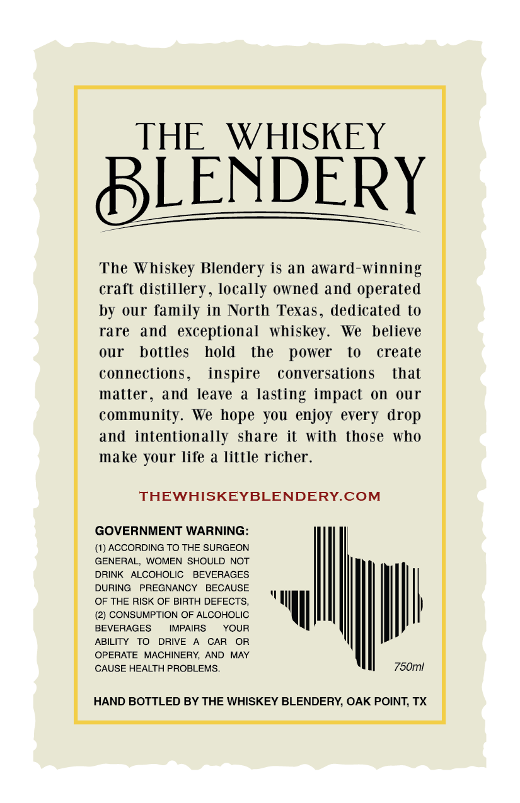

# TTB COLA Label Images - TTBID 26047001000165

**Brand Name:** THE WHISKEY BLENDERY

**Issue Date:** 02/20/2026

**Origin Code:** 44

**Product Class/Type:** 122

**Source:** [TTB Public COLA Registry](https://ttbonline.gov/colasonline/viewColaDetails.do?action=publicFormDisplay&ttbid=26047001000165)

## Label Images

### Back Label

## Extracted Label Text

*Text extracted via OCR - may contain errors*

### Back Label

THE WHISKEY

LENDER

—

Y

The Whiskey Blendery is an award-winning

craft distillery, locally owned and operated

by our family in North Texas, dedicated to

rare and exceptional whiskey. We believe

our bottles hold the power to create

connections,

inspire conversations

that

matter, and leave a lasting impact on our

community. We hope you enjoy every drop

and intentionally share it with those who

make your life a little richer.

THEWHISKEYBLENDERY.COM

GOVERNMENT WARNING:

(1) ACCORDING TO THE SURGEON

GENERAL, WOMEN SHOULD NOT

DRINK ALCOHOLIC BEVERAGES

DURING PREGNANCY BECAUSE

OF THE RISK OF BIRTH DEFECTS,

(2) CONSUMPTION OF ALCOHOLIC.

BEVERAGES

IMPAIRS

YOUR

ABILITY TO DRIVE A CAR OR

Ih

OPERATE MACHINERY, AND MAY

a

750m!

CAUSE HEALTH PROBLEMS.

HAND BOTTLED BY THE WHISKEY BLENDERY, OAK POINT, TX
