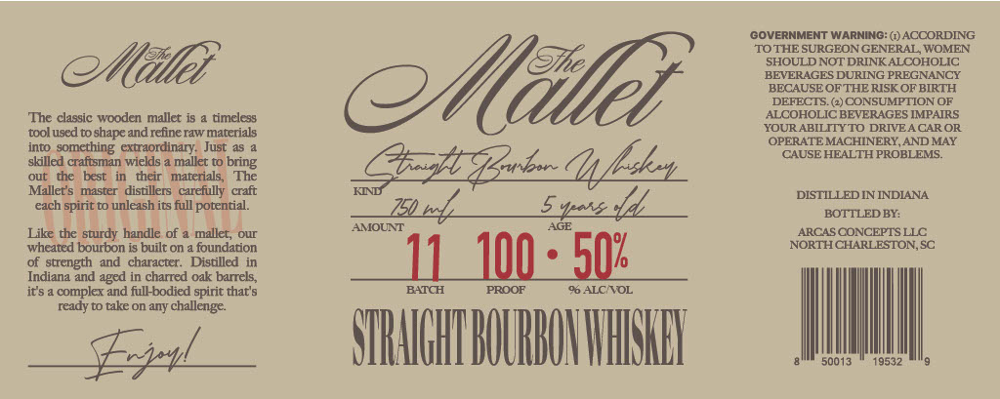

# TTB COLA Label Images - TTBID 26047001000281

**Brand Name:** THE MALLET

**Issue Date:** 02/19/2026

**Origin Code:** 41

**Product Class/Type:** 101

**Source:** [TTB Public COLA Registry](https://ttbonline.gov/colasonline/viewColaDetails.do?action=publicFormDisplay&ttbid=26047001000281)

## Label Images

### Label 1

## Extracted Label Text

*Text extracted via OCR - may contain errors*

### Label 1

(GOVERNMENT WARNING: () ACCORDING

‘TO THE SURGEON GENERAL, WOMEN

SHOULD NOT DRINK ALCOHOLIC

BEVERAGES DURING PREGNANCY

Mill?

BECAUSE OF THE RISK OF BIRTH

DEFECTS. (2) CONSUMPTION OF

‘The classic wooden mallet is a timeless

ALCOHOLIC BEVERAGES IMPAIRS

Mill

YOURABILITYTO DRIVE ACAROR

‘tool used to shape and refine raw materials

into,

‘OPERATE MACHINERY, AND MAY

extraordinary, Just a5 a

‘CAUSE HEALTH PROBLEMS.

skilled craftsman wiclds a mallet to bring

‘out the best in their materials, The

‘Mallet’s master distillers carefully craft

DISTILLED IN INDIANA

each spirit to unleash its full porential.

Spas dd,

BOTTLEDBY:

AMOUNT

wf.

Like the sturdy handle of a mallet, our

ARCAS CONCEPTS LLC

‘wheated bourbon is built on a foundation

NORTH CHARLESTON, SC

of

and character. Distilled in

Indiana and aged in charred oak barrels,

11 100-50

it's a complex and full-bodied spirit that's

96 ALCIVOL

ready to take on any challenge.

TRAGHT OLR

NSE

@

50013

19532

3

fp
