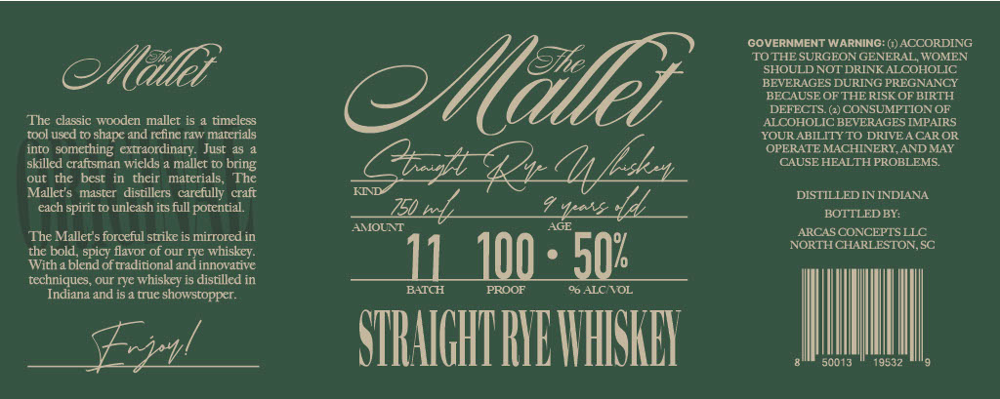

# TTB COLA Label Images - TTBID 26047001000287

**Brand Name:** THE MALLET

**Issue Date:** 02/19/2026

**Origin Code:** 41

**Product Class/Type:** 102

**Source:** [TTB Public COLA Registry](https://ttbonline.gov/colasonline/viewColaDetails.do?action=publicFormDisplay&ttbid=26047001000287)

## Label Images

### Label 1

## Extracted Label Text

*Text extracted via OCR - may contain errors*

### Label 1

GOVERNMENT WARNING: (i) ACCORDING:

‘TO THE SURGEON GENERAL, WOMEN

‘SHOULD NOT DRINK ALCOHOLIC

Mill?

BEVERAGES DURING PREGNANCY

BECAUSE OF THERISK OF BIRTH

DEFECTS. (2) CONSUMPTION OF

‘The classic wooden mallet is a timeless

ALCOHOLIC BEVERAGES IMPAIRS

Millis

YOUR ABILITYTO DRIVEACAROR.

tool used to shape and refine raw materials

OPERATE MACHINERY, AND MAY

into something extraordinary. Just a5 a

skilled craftsman wields a mallet to bring,

CAUSE HEALTH PROBLEMS.

out the best in their materials, ‘The

‘Mallet's master distillers carefully craft

KM

DISTILLED IN INDIANA

ach spirit to unleash its full porential

ED tof

tyes ld.

BOTTLED BY:

‘AMOUNT

‘The Mallet's forceful strike is mirrored in

ARCAS CONCEPTS LLC

the bold, spicy flavor of our rye whiskey.

NORTH CHARLESTON, SC

‘With a biend of traditional and innovative

100 - 50

techniques, our rye Whiskey is distilled in

8 ALC'VOL

Indiana and is a true showstopper.

/

l

TRAIT

tl

8

50013

19532
