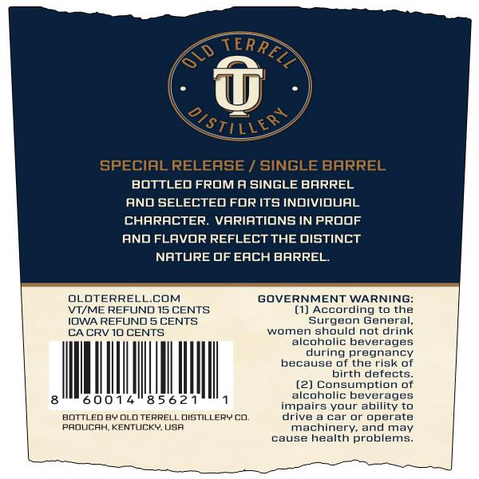
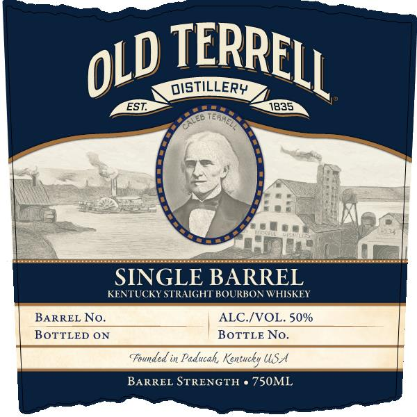

# TTB COLA Label Images - TTBID 26047001000378

**Brand Name:** OLD TERRELL

**Fanciful Name:** SINGLE BARREL

**Issue Date:** 03/03/2026

**Origin Code:** 22

**Product Class/Type:** 101

**Source:** [TTB Public COLA Registry](https://ttbonline.gov/colasonline/viewColaDetails.do?action=publicFormDisplay&ttbid=26047001000378)

## Label Images

### Back Label

### Front Label

## Extracted Label Text

*Text extracted via OCR - may contain errors*

**Detected Proof:** 100

### Back Label

( .

oa:

BOTTLED FROM A SINGLE BARREL

AND SELECTED FOR ITS INDIVIOUAL

CHARACTER. VARIATIONS IN PROOF

AND FLAVOR REFLECT THE DISTINCT

NATURE OF EACH BARREL.

OLOTERRELL.COM

GOVERNMENT WARNIN

\V1/ME REFUND 15 CENTS

() According to the

IOWA REFUND 5 CENTS

Surgeon General,

women should not drink

CACRV 10 CENTS

alcoholic beverages

during pregnancy

because of the risk of

birth defects.

) Consumption of

alcoholic beverages

Ml

14

56

impairs your ability to

BOTTLED Bl OLD TERRELL DISTILLERY CO.

drive a car or operate

PROUCAH, KENTUCKY, USA

machinery, and may

cause health problems.

eee

a

### Front Label

SINGLE BARREL

KENTUCKY STRAIGHT BOURBON WHISKEY

| Barret No. ALC./VOL. 50%
| BOTTLED ON BoTTLe No.

BARREL STRENGTH ¢ 750ML
