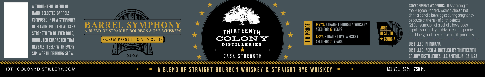

# TTB COLA Label Images - TTBID 26047001000460

**Brand Name:** THIRTEENTH COLONY DISTILLERIES, LLC

**Fanciful Name:** BARREL SYMPHONY

**Issue Date:** 02/18/2026

**Origin Code:** 08

**Product Class/Type:** 129

**Source:** [TTB Public COLA Registry](https://ttbonline.gov/colasonline/viewColaDetails.do?action=publicFormDisplay&ttbid=26047001000460)

## Label Images

### Label 1

### Label 2

## Extracted Label Text

*Text extracted via OCR - may contain errors*

### Label 1

A THOUGHTFUL BLEND OF

GOVERNMENT WARNING: (1) According to

6 ae

the Surgeon General, women should not

HAND-SELECTED BARRELS,

aS,

drink alcoholic beverages during pregnancy

COMPOSED INTO A SYMPHONY

because of the risk of birth defects.

aay

87% STRAIGHT BOURBON WHISKEY

OF FLAVOR. BOTTLED AT CASK

BARREL SYMPHONY

AGED FOR 6 YEARS

AGED

(2) Consumption of alcoholic beverages

STRENGTH 0 DELIVER BOLD,

A BLEND OF STRAIGHT BOURBON & RYE WHISKEYS

THIRTEENTH

IN SOUTH

impairs your ability to drive a car or operate

13% STRAIGHT RYE WHISKEY

machinery, and may cause health problems.

UNDILUTED CHARACTER THAT

(composition No. 1}

COLON YZ

AGED FOR 7 YEARS

> GEORGIA

REVEALS ITSELF WITH EVERY

*

DISTILLERIES

DISTILLED IN INDIANA

DISTILLED, AGED & BOTTLED BY THIRTEENTH

SIP. WORTH DRINKING SLOW.

CASK STRENGTH

COLONY DISTILLERIES, LLC AMERICUS, GA, USA

*

*

QQHQHUWW ..n999 999999 9999999999997 .".wyyw99999999 9999999999999}

13THCOLONYDISTILLERY.COM

<—* A BLEND OF STRAIGHT BOURBON WHISKEY & STRAIGHT RYE WHISKEY *——>

ACL/VOL: 59% - 750 ML

### Label 2

PSS SSS SSS SSS SSS SSS SSS SSS

THIRTEENTH

% STRAIGHT BOURBON % c

OLON YZ

STRAIGHT RYE

*

STILLERIE

ALAA LLL LLL LL LL LM hhh hh hh hh hh hhh hh hhh hhh hhh hhh hb hh hh hhh hhh hhh hh hhh hh hh hhh hhh hhh hh hh hh hh hhh hhh hh hhh hhh hhh hh hhh hhh hhh hh hh hh ht
