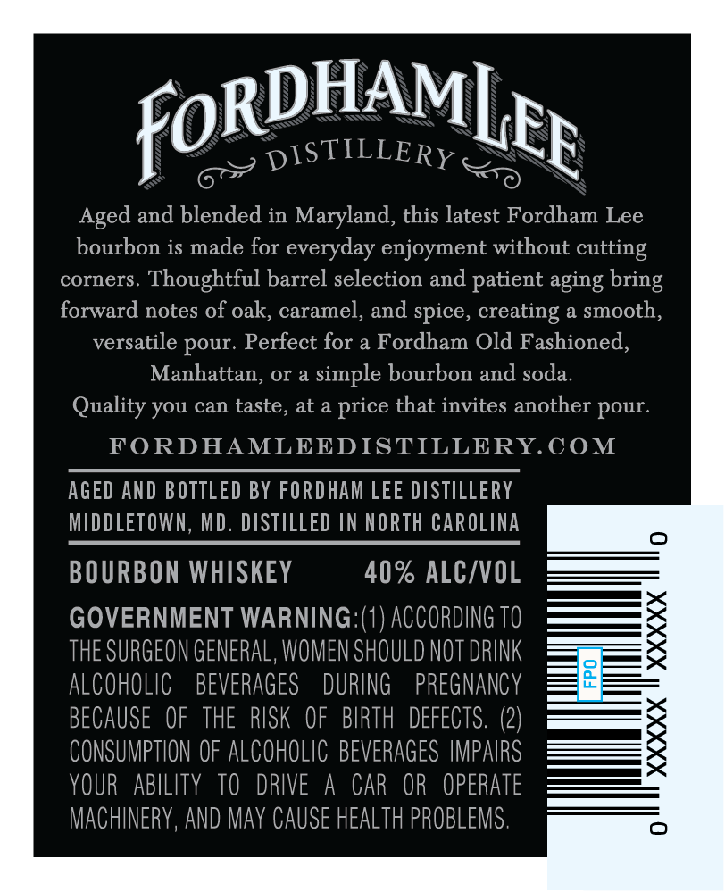

# TTB COLA Label Images - TTBID 26047001000536

**Brand Name:** FORDHAM LEE DISTILLERY

**Issue Date:** 02/24/2026

**Origin Code:** 25

**Product Class/Type:** 141

**Source:** [TTB Public COLA Registry](https://ttbonline.gov/colasonline/viewColaDetails.do?action=publicFormDisplay&ttbid=26047001000536)

## Label Images

### Back Label

## Extracted Label Text

*Text extracted via OCR - may contain errors*

### Back Label

RDHAM

for

pisTILLERy

Lig

Aged and blended in Maryland, this latest Fordham Lee

bourbon is made for everyday enjoyment without cutting

corners. Thoughtful barrel selection and patient aging bring

forward notes of oak, caramel, and spice, creating a smooth

versatile pour. Perfect for a Fordham Old Fashioned

Manhattan, or a simple bourbon and soda

Quality you can taste, at a price that invites another pour

FORDHAMLEEDISTILLERY.COM

AGED AND BOTTLED BY FORDHAM LEE DISTILLERY

MIDDLETOWN, MD. DISTILLED IN NORTH CAROLINA

BOURBON WHISKEY

40% ALC/VOL

GOVERNMENT WARNING: (1) ACCORDING T0

——te

THE SURGEON GENERAL, WOMEN SHOULD NOT DRINK

— 5

ALCOHOLIC BEVERAGES DURING PREGNANCY

BECAUSE OF THE RISK OF BIRTH DEFECTS. (2)

CONSUMPTION OF ALCOHOLIC BEVERAGES IMPAIRS

YOUR ABILITY TO DRIVE A CAR OR OPERATE

MACHINERY, AND MAY CAUSE HEALTH PROBLEMS
