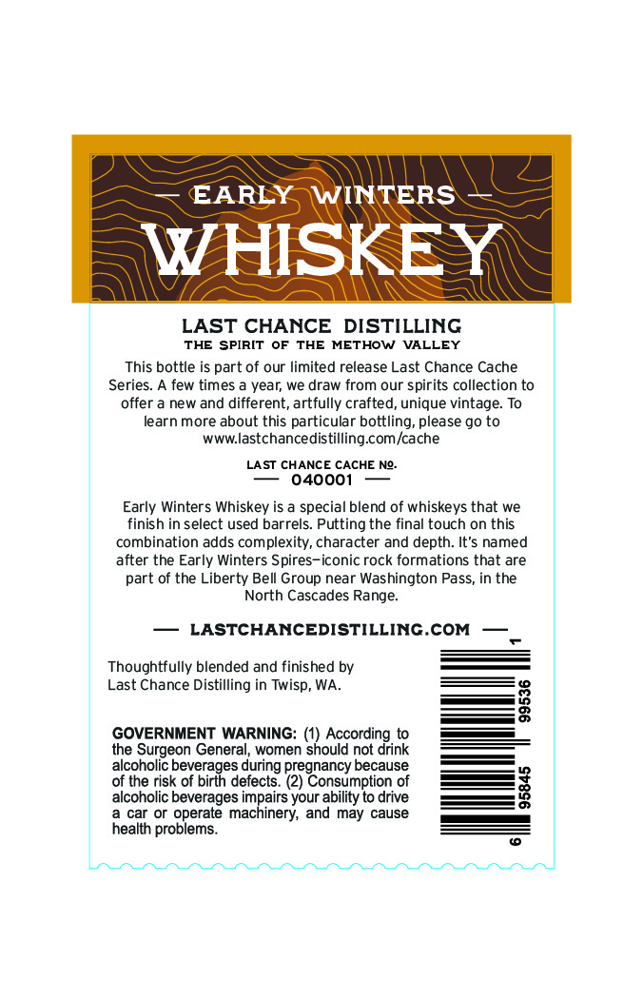
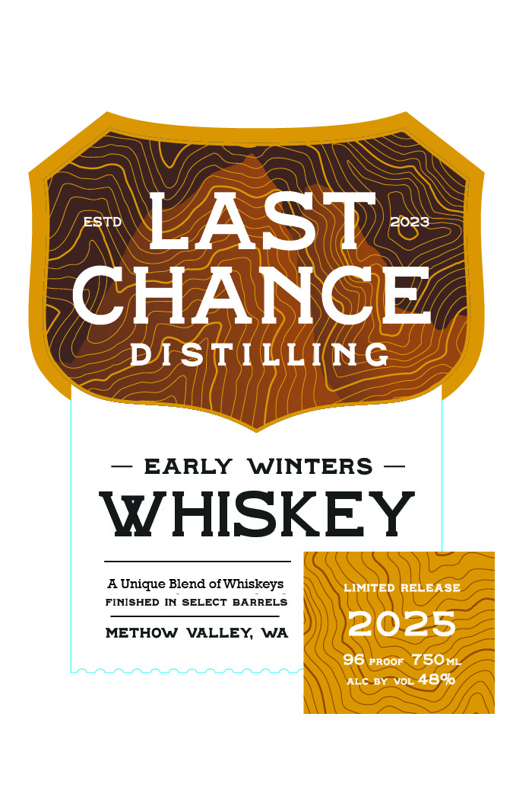

# TTB COLA Label Images - TTBID 26047001000695

**Brand Name:** LAST CHANCE DISTILLING

**Issue Date:** 02/19/2026

**Origin Code:** 07

**Product Class/Type:** 140

**Source:** [TTB Public COLA Registry](https://ttbonline.gov/colasonline/viewColaDetails.do?action=publicFormDisplay&ttbid=26047001000695)

## Label Images

### Back Label

### Front Label

## Extracted Label Text

*Text extracted via OCR - may contain errors*

### Back Label

— EARLY WINTERS

WHISKEY

LAST CHANCE DISTILLING

THE SPIRIT OF THE METHOW VALLEY

This bottle is part of our limited release Last Chance Cache

Series. A few times a year, we draw from our spirits collection to

offer a new and different, artfully crafted, unique vintage. To

learn more about this particular bottling, please go to

www.lastchancedistilling.com/cache

LAST CHANCE CACHE No.

— 040001 —

Early Winters Whiskey is a special blend of whiskeys that we

finish in select used barrels. Putting the final touch on this

combination adds complexity, character and depth. It's named

after the Early Winters Spires-iconic rock formations that are

part of the Liberty Bell Group near Washington Pass, in the

North Cascades Range.

— LASTCHANCEDISTILLING.COM —

Thoughtfully blended and finished by

Last Chance Distilling in Twisp, WA.

GOVERNMENT WARNING: (1) According to

alcoholic bevera

the Surgeon General, women should not drink

jes during pregnancy because

of the risk of bit

rh

defects. (2) Consumption of

alcoholic beverages impairs your ability to drive

a car or operate machinery, and may cause

health problems.

### Front Label

y AN; =I
J ST . zy A aw) Mess
QWs Tyas ZA
— Ah | /| SE
— EARLY WINTERS —
AUnique Blend of Whiskeys \ — eae
FINISHED IN SELECT BARRELS \\ (MV a
METHOW VALLEY, WA | ) 202. > |
WEF
AWS
WAAR
