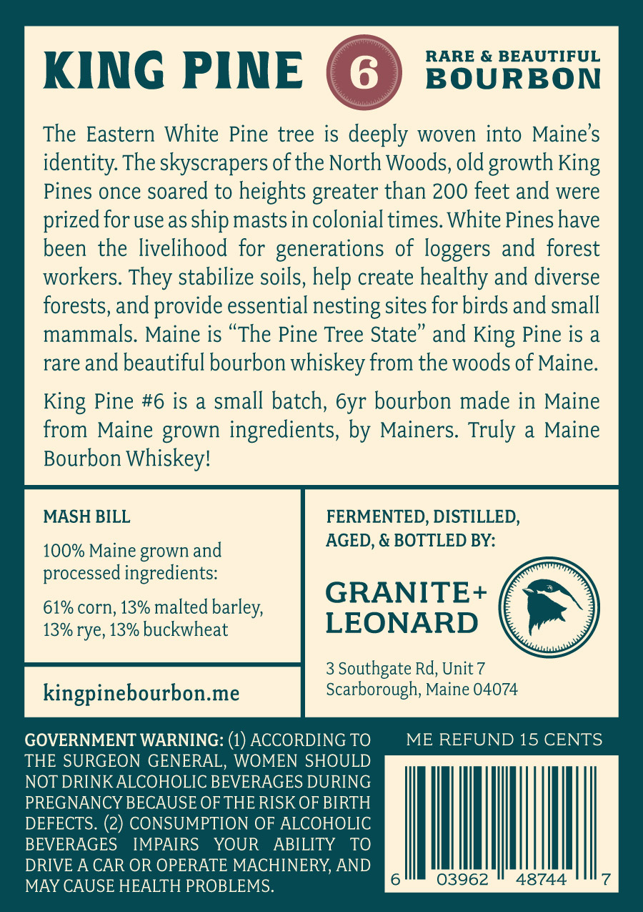
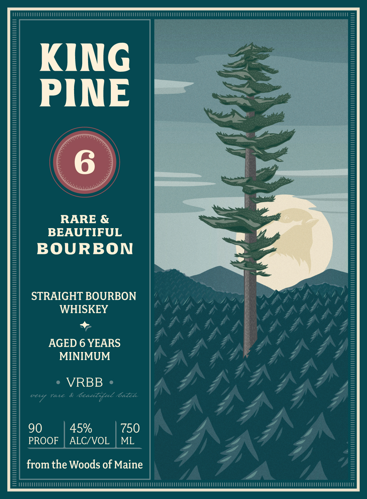

# TTB COLA Label Images - TTBID 26048001000031

**Brand Name:** KING PINE

**Issue Date:** 02/19/2026

**Origin Code:** 24

**Product Class/Type:** 101

**Source:** [TTB Public COLA Registry](https://ttbonline.gov/colasonline/viewColaDetails.do?action=publicFormDisplay&ttbid=26048001000031)

## Label Images

### Back Label

### Front Label

## Extracted Label Text

*Text extracted via OCR - may contain errors*

### Back Label

RARE & BEAUTIFUL

BOURBON

KING PINE (

The Eastern White Pine tree is deen woven into Maine’s

identity. The skyscrapers of the North Woods, old growth King

Pines once soared to heights greater than 200 feet and were

prized for use as ship masts in colonial times. White Pines have

been the livelihood for generations of loggers and forest

workers. They stabilize soils, help create healthy and diverse

forests, and provide essential nesting sites for birds and small

mammals. Maine is “The Pine Tree State” and King Pine is a

rare and beautiful bourbon whiskey from the woods of Maine.

King Pine #6 is a small batch, 6yr bourbon made in Maine

from Maine grown ingredients, by Mainers. Truly a Maine

Bourbon Whiskey!

MASH BILL

FERMENTED, DISTILLED,

AGED, & BOTTLED BY:

100% Maine grown and

processed ingredients:

GRANITE+

61% corn, 13% malted barley,

13% rye, 13% buckwheat

LEONARD

3 Southgate Rd, Unit 7

Scarborough, Maine 04074

ME REFUND 15 CENTS

GOVERNMENT WARNING: (1) ACCORDING TO

THE SURGEON GENERAL, WOMEN SHOULD

NOT DRINK ALCOHOLIC BEVERAGES DURING

PREGNANCY BECAUSE OF THE RISK OF BIRTH

DEFECTS. (2) CONSUMPTION OF ALCOHOLIC

BEVERAGES

IMPAIRS YOUR ABILITY TO

DRIVE A CAR

OPERATE MACHINERY, AND

MAY CAUSE HEALTH PROBLEMS.

3962

48744

### Front Label

ECO CCC

=

KING |

a

PINE

wee, —

a

Sa) DN

RARE &

nl, <

BEAUTIFUL

BOURBON

’ ‘Se

STRAIGHT BOURBON

WHISKEY

+

AGED 6 YEARS

MINIMUM

° VRBB »

& be

L.

h

wey ace

90

45%

750

PROOF

ALC/VOL | ML

from the Woods of Maine

FIEEITENTTUENETETTEETM TET ETeee
