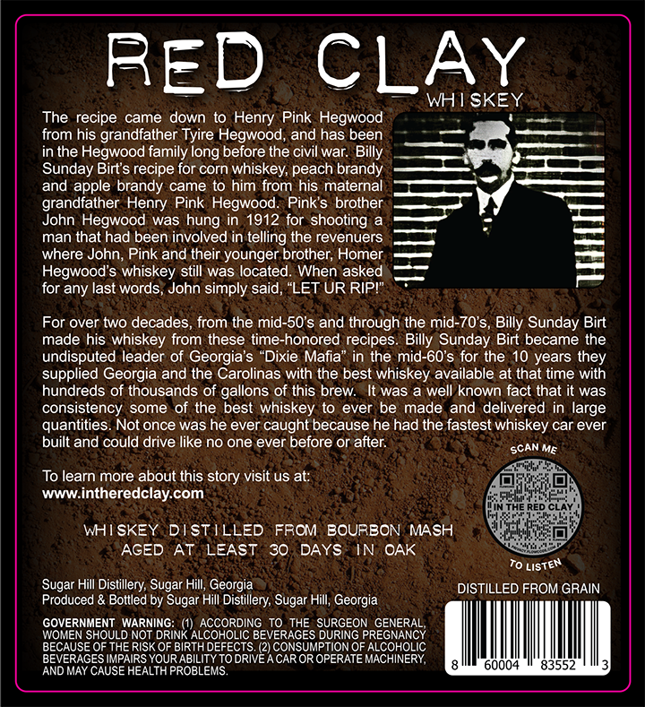
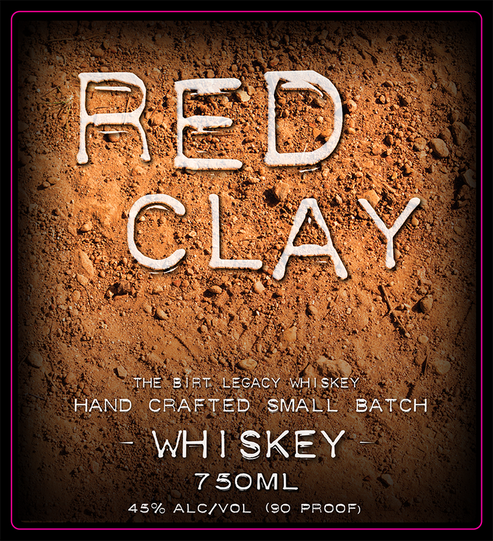

# TTB COLA Label Images - TTBID 26048001000073

**Brand Name:** RED CLAY

**Issue Date:** 02/19/2026

**Origin Code:** 08

**Product Class/Type:** 140

**Source:** [TTB Public COLA Registry](https://ttbonline.gov/colasonline/viewColaDetails.do?action=publicFormDisplay&ttbid=26048001000073)

## Label Images

### Back Label

### Front Label

## Extracted Label Text

*Text extracted via OCR - may contain errors*

### Back Label

a ~ WHISKEY
The recipe came down to Henry Pink Hegwood . 0 ne
from his grandfather Tyire Hegwood, and has been — a
in the Hegwood family long before the civil war. Billy Srerr
Sunday Birt's recipe for corn whiskey, peach brandy i: ——
and apple brandy came to him from his maternal [>
grandfather Henry Pink Hegwood. Pink's brother, ——T rY =
John Hegwood was hung in 1912 for shooting a 4 :
man that had been involved in telling the revenuers <> 4 =
where John, Pink and their younger brother, Homer, === P|
Hegwood's whiskey still was located. When asked =
for any last words, John simply said, “LET UR RIP!" ="
For over two decades, from the mid-50's and through the mid-70’'s, Billy Sunday Birt
made his whiskey from these time-honored recipes. Billy Sunday Birt became the
undisputed leader of Georgia's “Dixie Mafia” in the mid-60's for the 10 years they
supplied Georgia and the Carolinas with the best whiskey available at that time with
hundreds of thousands of gallons of this brew. It was a well known fact that it was
consistency some of the best whiskey to ever be made and delivered in large
quantities. Not once was he ever caught because he had the fastest whiskey car ever
built and could drive like no one ever before or after. ecAN Me
cei
To learn more about this story visit us at: ats
www.intheredclay.com PSE ey
WHISKEY DISTILLED FROM BOURBON MASH — Whthincicy
AGED AT LEAST 30 DAYS IN OAK a
Tost
Sugar Hill Distillery, Sugar Hill, Georgia DISTILLED FROM GRAIN
Produced & Bottled by Sugar Hill Distillery, Sugar Hill, Georgia
GOVERNMENT WARNING: (1) ACCORDING TO THE SURGEON GENERAL,
WOMEN SHOULD NOT DRINK ALCOHOLIC BEVERAGES DURING PREGNANCY
BECAUSE OF THE RISK OF BIRTH DEFECTS. (2) CONSUMPTION OF ALCOHOLIC
BEVERAGES IMPAIRS YOUR ABILITY TO DRIVE ACAROR OPERATE MACHINERY, PMI etna eo BLES
AND MAY CAUSE HEALTH PROBLEMS.

### Front Label

: : . eee
a oe WBA MERE BS ge:
) Eke SORE Been | PO
S (en hes re pae OS.
co SGN RS Le 2 AES
So
LES ERE EC See ae RS RATS
Re eee ea eo” UR noes rn
ou se Se a
Rk |g) AG a RS STAN CRY
Sieve tae RAS ERR PRS SRS Weerned SS ‘
Pe canes ER Pars cae fee
oe RY ESSE pescge Ve
BL DOOM E ehe S tad oe
Se a eS ¥ LARUE hey
“THES BIRT LEGACY WHISKEY
HAND CRAFTED SMALL BATCH
“WH SKEYe:
7T50ML
45% ALC/VOL (0 PROOF)
