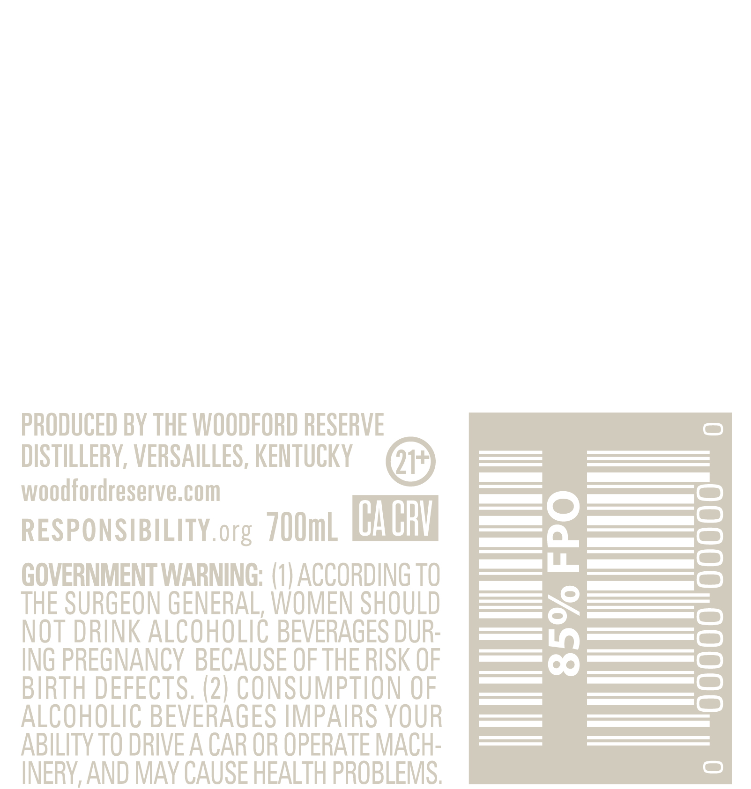

# TTB COLA Label Images - TTBID 26048001000075

**Brand Name:** WOODFORD RESERVE

**Fanciful Name:** MASTER'S COLLECTION SUPER SEASONED OAK BOURBON

**Issue Date:** 03/04/2026

**Origin Code:** 22

**Product Class/Type:** 101

**Source:** [TTB Public COLA Registry](https://ttbonline.gov/colasonline/viewColaDetails.do?action=publicFormDisplay&ttbid=26048001000075)

## Label Images

### Back Label

### Front Label

### Label 4

## Extracted Label Text

*Text extracted via OCR - may contain errors*

*2 image(s) excluded: text did not meet readability threshold*

### Back Label

PRODUCED BY THE WOODFORD RESERVE
DISTILLERY, VERSAILLES, KENTUCKY
woodfordreserve.com

RESPONSIBILITY.org 700mL LEAL!

GOVERNMENT WARNING: (1) ACCORDING TO
THE SURGEON GENERAL, WOMEN SHOULD
NOT DRINK ALCOHOLIC BEVERAGES DUR-
ING PREGNANCY BECAUSE OF THE RISK OF
BIRTH DEFECTS. (2) CONSUMPTION OF
ALCOHOLIC BEVERAGES IMPAIRS YOUR
ABILITY TO DRIVE A CAR OR OPERATE MACH-
INERY, AND MAY CAUSE HEALTH PROBLEMS.
