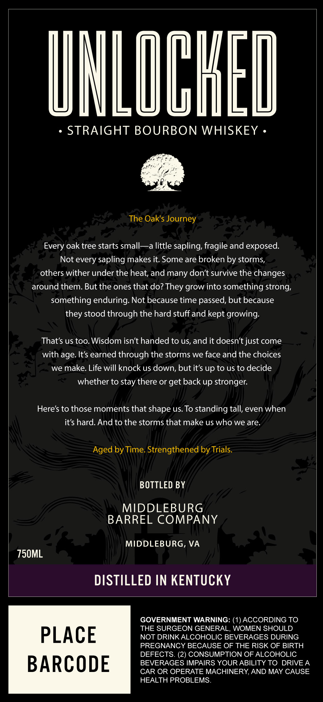
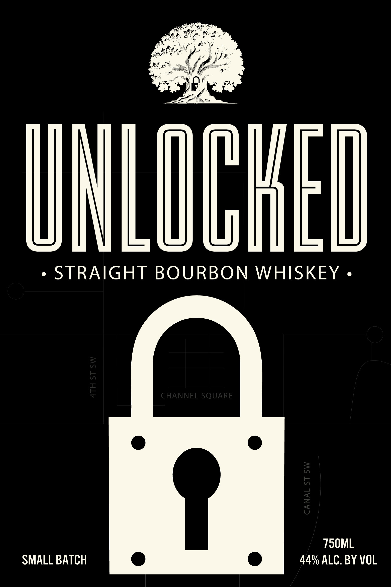
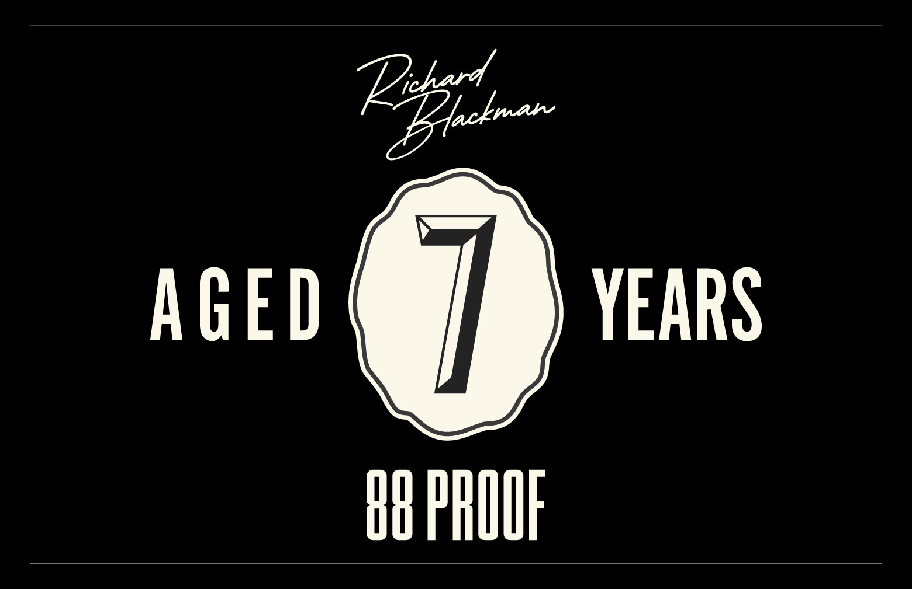

# TTB COLA Label Images - TTBID 26048001000089

**Brand Name:** UNLOCKED

**Issue Date:** 02/19/2026

**Origin Code:** 05

**Product Class/Type:** 101

**Source:** [TTB Public COLA Registry](https://ttbonline.gov/colasonline/viewColaDetails.do?action=publicFormDisplay&ttbid=26048001000089)

## Label Images

### Back Label

### Label 1

### Label 2

## Extracted Label Text

*Text extracted via OCR - may contain errors*

### Back Label

UNLUGh

* STRAIGHT BOURBON WHISKEY -

‘e

The Oak's Journey

Every oak tree starts small—a little sapling, fragile and exposed.

Not every sapling makes it. Some are broken by storms,

others wither under the heat, and many don't survive the changes

around them. But the ones that do? They grow into something strong,

something enduring. Not because time passed, but because

they stood through the hard stuff and kept growing.

That's us too. Wisdom isn’t handed to us, and it doesn’t just come

with age. It’s earned through the storms we face and the choices

we make. Life will knock us down, but it’s up to us to decide

whether to stay there or get back up stronger.

Here's to those moments that shape us. To standing tall, even when

it’s hard. And to the storms that make us who we are.

Aged by Time. Strengthened by Trials.

BOTTLED BY

MIDDLEBURG

BARREL COMPANY

MIDDLEBURG, VA

T50ML

DISTILLED IN KENTUCKY

GOVERNMENT WARNING: (1) ACCORDING TO

THE SURGEON GENERAL, WOMEN SHOULD

PLACE

NOT DRINK ALCOHOLIC BEVERAGES DURING

PREGNANCY BECAUSE OF THE RISK OF BIRTH

DEFECTS. (2) CONSUMPTION OF ALCOHOLIC

BEVERAGES IMPAIRS YOUR ABILITY TO DRIVE A

BARCODE

CAR OR OPERATE MACHINERY, AND MAY CAUSE

HEALTH PROBLEMS.

### Label 1

Lia

INLOC

¢ STRAIGHT BOURBON WHISKEY -»

750ML

SMALL BATCH

44% ALC. BY VOL

### Label 2

EB Loa

TY )

8 PROOF
