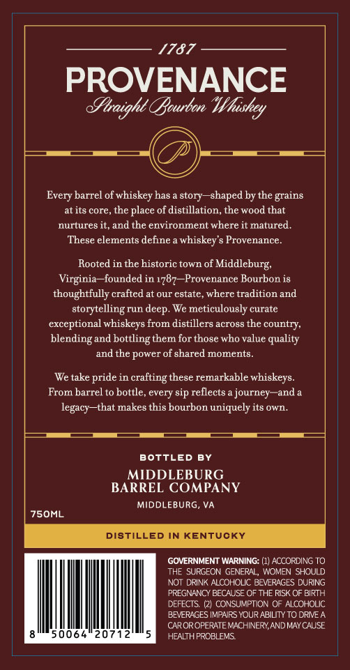
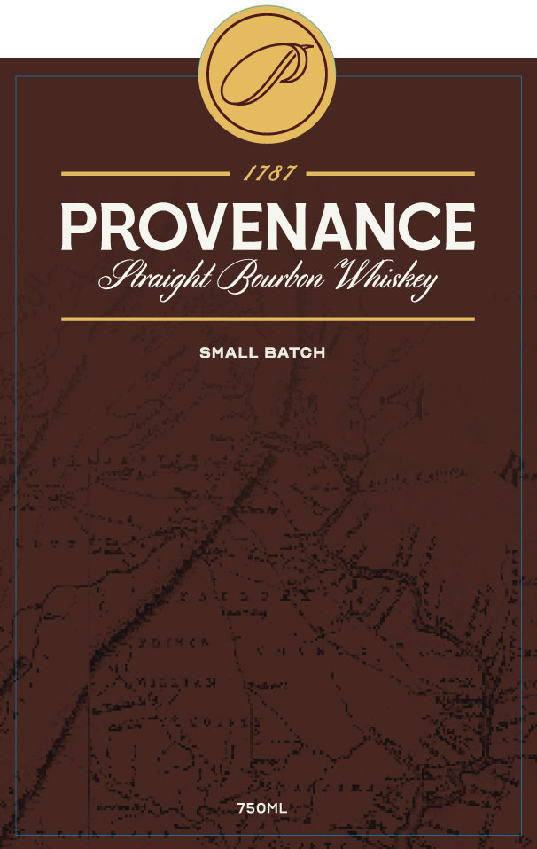
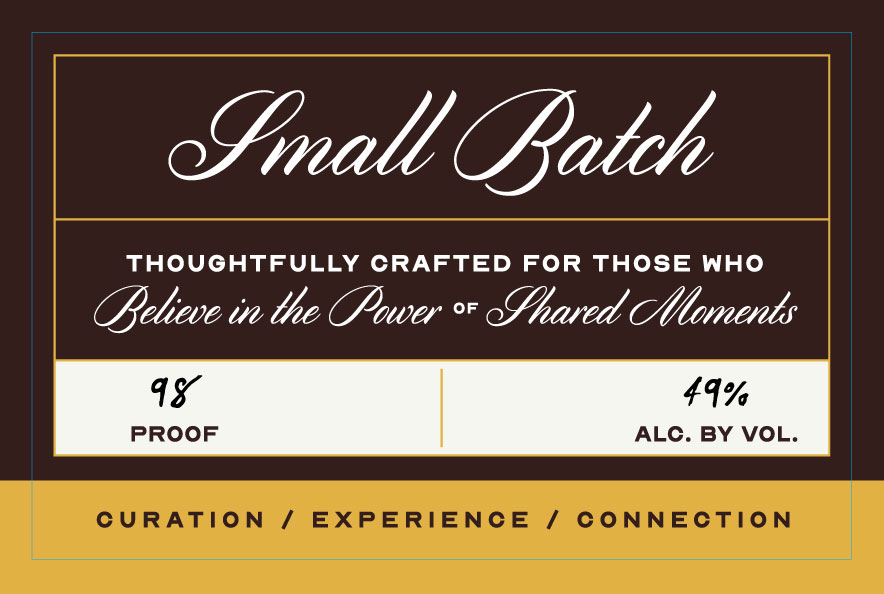

# TTB COLA Label Images - TTBID 26048001000175

**Brand Name:** PROVENANCE

**Issue Date:** 02/19/2026

**Origin Code:** 05

**Product Class/Type:** 101

**Source:** [TTB Public COLA Registry](https://ttbonline.gov/colasonline/viewColaDetails.do?action=publicFormDisplay&ttbid=26048001000175)

## Label Images

### Back Label

### Label 1

### Label 3

## Extracted Label Text

*Text extracted via OCR - may contain errors*

*1 image(s) excluded: text did not meet readability threshold*

### Back Label

———
Every barrel of whiskey has a story—shaped hy the grains
atits core, the place of distillation, the wood that
nurtures it, and the environment where it matured.
These elements define a whiskey's Provenance.
Rooted in the historic town of Middleburg,
Virginia—founded in 1787—Provenance Bourbon is
thoughtfully crafted at our estate, where tradition and
storytelling run deep. We meticulously curate
exceptional whiskeys from distillers across the country,
blending and bottling them for those who value quality
and the power of shared moments.
We take pride in crafting these remarkable whiskeys.
From barrel to bottle, every sip reflects a journey—and a
legacy—that makes this bourbon uniquely its own.
BOTTLED BY
MIDDLEBURG
BARREL COMPANY
MIDDLEBURG, VA
7SOML
DISTILLED IN KENTUCKY
GOVERNMENT WARNING: (1) ACCORDING TO.
THE SURGEON GENERAL, WOMEN SHOULD
NOT DRINK ALCOHOLIC BEVERAGES DURING
PREGNANCY BECALISE OF THE RISK OF BIRTH
DEFECTS. (2) CONSUMPTION OF ALCOHOLIC
BEVERAGES INPARS YOUR ABILITY TO DRVEA
CAROROPERATE MACHINERY AND MAYCALISE
gim50064"20712."5 MNase

### Label 3

Sinall fateh

THOUGHTFULLY CRAFTED FOR THOSE WHO

Believe in the Power * Shared Menents

1¥

19%

PROOF

ALC. BY VOL.

|
