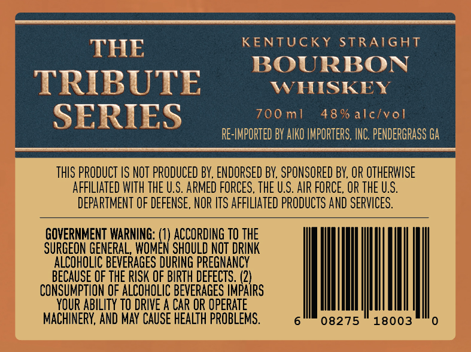
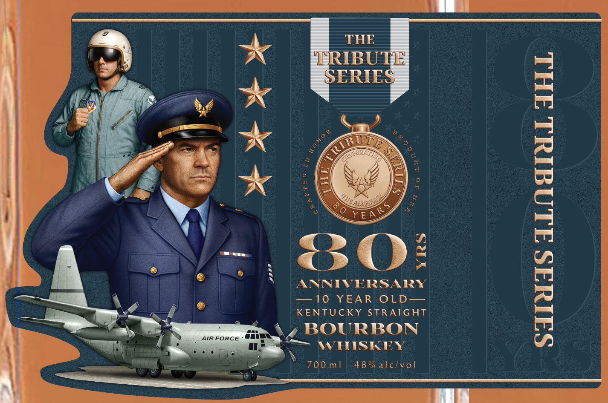
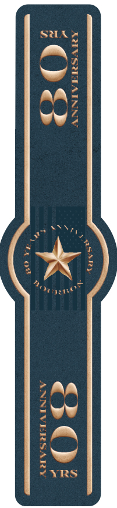

# TTB COLA Label Images - TTBID 26048001000238

**Brand Name:** THE TRIBUTE SERIES

**Issue Date:** 02/20/2026

**Origin Code:** 00

**Product Class/Type:** 101

**Source:** [TTB Public COLA Registry](https://ttbonline.gov/colasonline/viewColaDetails.do?action=publicFormDisplay&ttbid=26048001000238)

## Label Images

### Back Label

### Front Label

### Label 2

## Extracted Label Text

*Text extracted via OCR - may contain errors*

### Back Label

KENTUCKY STRAIGHT

THE

BOURBON

TRIBUTE

WHISKEY

700 m1

48% alc/vol

SERIES

RE-IMPORTED BY AIKO IMPORTERS, INC. PENDERGRASS GA

THIS PRODUCT IS NOT PRODUCED BY, ENDORSED BY, SPONSORED BY, OR OTHERWISE

AFFILIATED WITH THE U.S. ARMED FORCES, THE U.S. AIR FORCE, OR THE U.S.

___ DEPARTMENT OF DEFENSE, NOR ITS AFFILIATED PRODUCTS AND SERVICES. OF DEFENSE, NOR ITS AFFILIATE

PRODUCTS AND SERVICES.

GOVERNMENT WARNING:

ACCORDING TO THE

SURGEON GENERAL, ee

nw

fae i DRINK

ACO 8 EVERAG

en

ae

RISK

cONSLMPTION OF AUIHOLIE BETEREGES Hiss

vat ABILITY TO DRIVE A CAR OR OPERATE

=e. Il

(CHINERY, AND MAY CAUSE HEALTH PROBLEMS.

6

08275 180

(0)

### Front Label

i

.|

THE

*

IBU

a

ERIE

a

ZA

A

rat

Fz

a |

=

AY

ys

Ay

i

se

ssa

ig

=

{

= eee

<3O

o>

sp!

ANNIVERSARY

=—10 YEAREOLD——

KENTUCKY STRAIGHT

ainrorce data

4.6 BOURBON

gp)

a

ark,

~ WHISKEY

700 ml

A

a

vol

A

Mw

### Label 2

y

a

Ne

L-

An

|
