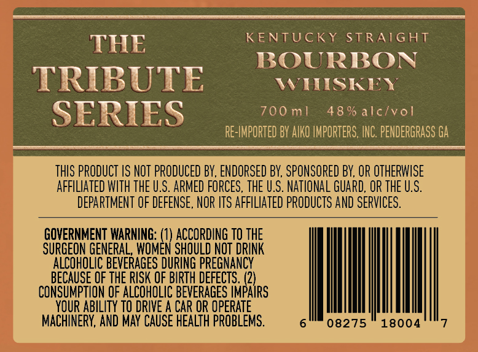

# TTB COLA Label Images - TTBID 26048001000282

**Brand Name:** THE TRIBUTE SERIES

**Issue Date:** 02/19/2026

**Origin Code:** 00

**Product Class/Type:** 101

**Source:** [TTB Public COLA Registry](https://ttbonline.gov/colasonline/viewColaDetails.do?action=publicFormDisplay&ttbid=26048001000282)

## Label Images

### Back Label

### Label 2

## Extracted Label Text

*Text extracted via OCR - may contain errors*

*1 image(s) excluded: text did not meet readability threshold*

### Back Label

THE KENTUCKY STRAIGHT
BOURBON
TRIBULE “onions
SERIES 700ml 48% alc/vol
g - RE-IMPORTED BY AIKO INPORTERS, INC. PENDERGRASS GA |
THIS PRODUCT IS NOT PRODUCED BY, ENDORSED BY, SPONSORED BY, OR OTHERWISE
AFFILIATED WITH THE U.S. ARMED FORCES, THE U.S. NATIONAL GUARD, OR THE U.S.
DEPARTMENT OF DEFENSE, NOR ITS AFFILIATED PRODUCTS AND SERVICES.
GOVERNMENT WARNING: {i ACCORDING TO THE
SURGEON GENERAL, WOMEN SHOULD NOT DRINK
ALCOHOLIC BEVERAGES DURING PREGNANCY
BECAUSE OF THE RISK OF BIRTH DEFECTS. (2)
CONSUMPTION OF ALCOHOLIC BEVERAGES IMPAIRS
YOUR ABILITY TO DRIVE A CAR OR OPERATE
MACHINERY, AND MAY CAUSE HEALTH PROBLEMS. 608275" 18004''7
