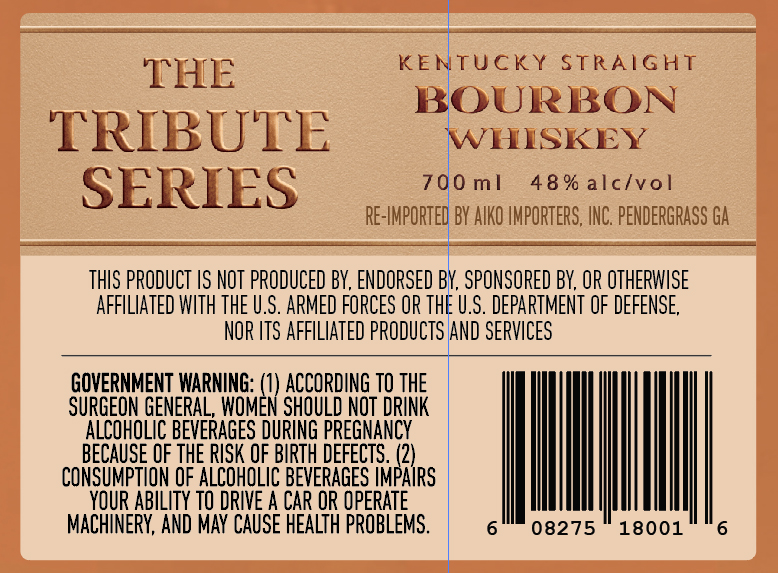
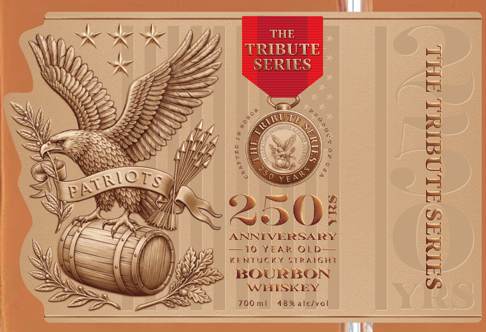
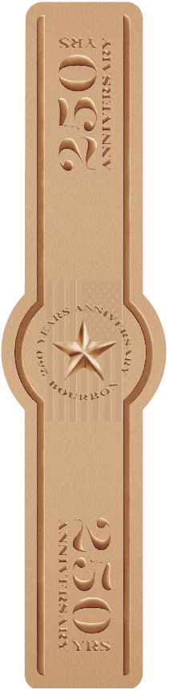

# TTB COLA Label Images - TTBID 26048001000308

**Brand Name:** THE TRIBUTE SERIES

**Issue Date:** 02/20/2026

**Origin Code:** 00

**Product Class/Type:** 101

**Source:** [TTB Public COLA Registry](https://ttbonline.gov/colasonline/viewColaDetails.do?action=publicFormDisplay&ttbid=26048001000308)

## Label Images

### Back Label

### Front Label

### Label 2

## Extracted Label Text

*Text extracted via OCR - may contain errors*

### Back Label

—_——

———

THE

KENTUCKY STRAIGHT

BOURBON

TRIBUTE

WHISKEY

SERIES

700ml

48% alc/vol

R

ORTED BY AIKO IMPORTERS, INC. PENDERGRASS GA

a

_

a

THIS PRODUCT IS NOT PRODUCED BY, EN

SED BY, SPONSORED BY, OR OTHERWISE

AFFILIATED WITH THE U.S. ARMED FORCES OR THE U.S. DEPARTMENT OF DEFENSE

NOR ITS AFFILIATED P

UCTS AND SERVICES

GOVERNMENT WARNING:

1) ACCORDING

THE

SURGEON GENERAL, WOM

N SHOULD NOT DRINK

ALCOHOLIC BEVERAGES DURING PREGNANI

BECAUSE OF THE RISK OF BIRTH DEFECTS. (2

CONSUMPTION OF ALCOHOLIC BEVERAGES NPS

YOUR ABILITY TO DRIVE A CAR OR OPE! i

; |

MACHINERY, AND MAY CAUSE HEALTH PRI

08275 18001

### Front Label

ii

SF SFT SZ

SE

NEV

TRIBUT

E -

ba}

GE

Bue

x

)

%

Ws

£4

bri

by)

Wy,

. Sed

pe)

Ss

as

SE

Ne

vl

S

eff

CONG?

S

Hf

Ss

la

i

ANS

Fe

NS

W)

XS

seule

ey

ENS

Wis

NS

bd

VA

\)

Sinn

he

| a

2

e>

4

(

a

aK

—

7

ANNIVERSARY

br

—-

Af

SLO EAR OD

i

KENTUCKY STRAIGHT

‘

f

i

BOURBON

=

WHISKEY

Z—_S

7OOml 48% =
