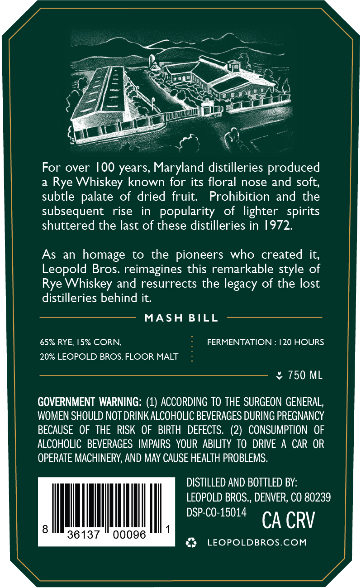

# TTB COLA Label Images - TTBID 26048001000408

**Brand Name:** LEOPOLD BROS.

**Fanciful Name:** MARYLAND STYLE

**Issue Date:** 02/19/2026

**Origin Code:** 13

**Product Class/Type:** 142

**Source:** [TTB Public COLA Registry](https://ttbonline.gov/colasonline/viewColaDetails.do?action=publicFormDisplay&ttbid=26048001000408)

## Label Images

### Back Label

## Extracted Label Text

*Text extracted via OCR - may contain errors*

### Back Label

a

er

ra

——.. 0.

Ee

a

Un

A=

Sales]

A

%

SE

as

aN

NY

we

mull ev

(el

—

ag

salt

.

For over 100 years, Maryland distilleries produced

a Rye Whiskey known for its floral nose and soft,

subtle palate of dried fruit.

Prohibition and the

subsequent rise in popularity of lighter spirits

shuttered the last of these distilleries in 1972.

As an homage to the pioneers who created it,

Leopold Bros. reimagines this remarkable style of

Rye Whiskey and resurrects the legacy of the lost

distilleries behind it.

MASH BILL

65% RYE, 15% CORN,

FERMENTATION :

20 HOURS

20% LEOPOLD BROS. FLOOR MALT

> 750 ML

GOVERNMENT WARNING: (1) ACCORDING TO THE SURGEON GENERAL,

WOMEN SHOULD NOT DRINK ALCOHOLIC BEVERAGES DURING PREGNANCY

BECAUSE OF THE RISK OF BIRTH DEFECTS. (2) CONSUMPTION OF

ALCOHOLIC BEVERAGES IMPAIRS YOUR ABILITY TO DRIVE A CAR OR

OPERATE MACHINERY, AND MAY CAUSE HEALTH PROBLEMS.

DISTILLED AND BOTTLED BY:

LEOPOLD BROS., DENVER, CO 80239

I

I

1

DSP-CO-15014 CA CRV

36137 " 00096

3 +LEOPOLDBROS.COM
