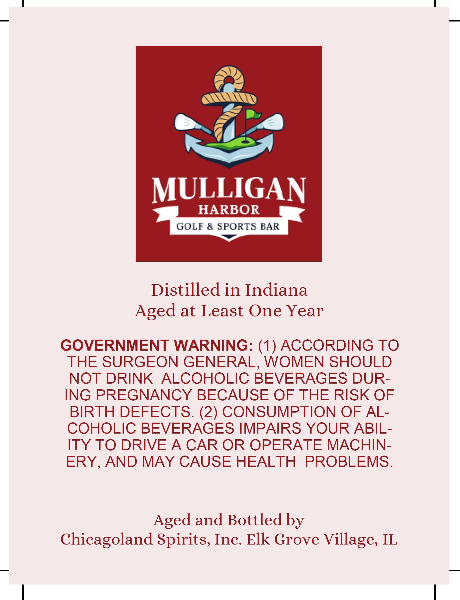

# TTB COLA Label Images - TTBID 26048001000492

**Brand Name:** MULLIGAN HARBOR GOLF & SPORTS BAR

**Issue Date:** 02/19/2026

**Origin Code:** 04

**Product Class/Type:** 141

**Source:** [TTB Public COLA Registry](https://ttbonline.gov/colasonline/viewColaDetails.do?action=publicFormDisplay&ttbid=26048001000492)

## Label Images

### Back Label

## Extracted Label Text

*Text extracted via OCR - may contain errors*

### Back Label

MULLIGAN

HARBOR |
——

Distilled in Indiana
Aged at Least One Year

GOVERNMENT WARNING: (1) ACCORDING TO
THE SURGEON GENERAL, WOMEN SHOULD
NOT DRINK ALCOHOLIC BEVERAGES DUR-
ING PREGNANCY BECAUSE OF THE RISK OF
BIRTH DEFECTS. (2) CONSUMPTION OF AL-
COHOLIC BEVERAGES IMPAIRS YOUR ABIL-
ITY TO DRIVE A CAR OR OPERATE MACHIN-
ERY, AND MAY CAUSE HEALTH PROBLEMS.

Aged and Bottled by
Chicagoland Spirits, Inc. Elk Grove Village, IL
