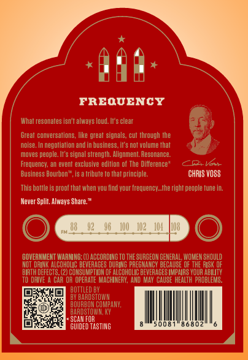
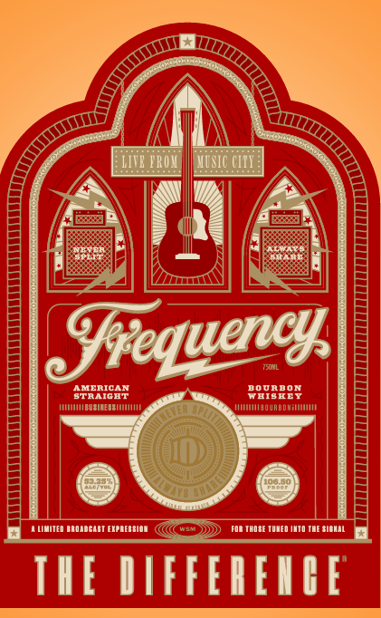

# TTB COLA Label Images - TTBID 26048001000586

**Brand Name:** THE DIFFERENCE

**Issue Date:** 02/20/2026

**Origin Code:** 22

**Product Class/Type:** 101

**Source:** [TTB Public COLA Registry](https://ttbonline.gov/colasonline/viewColaDetails.do?action=publicFormDisplay&ttbid=26048001000586)

## Label Images

### Back Label

### Front Label

### Label 3

## Extracted Label Text

*Text extracted via OCR - may contain errors*

*1 image(s) excluded: text did not meet readability threshold*

### Back Label

FREQUENCY

CHRIS Voss

Never Split. Always Share."

CET

©)

uted st

8

!

50081" 86802!

|

### Front Label

#

VE PROM,

MUS!

In

xN

lA

2.

Soro uervey,

oJ reque

ERICAN

AGE

WHISREY

pounnon

can

TH

IFFERENRE.
