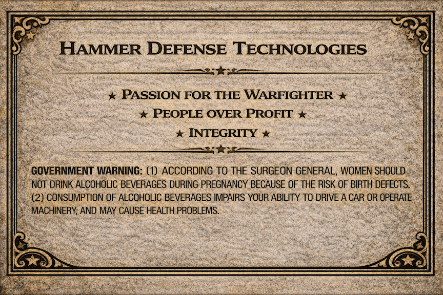
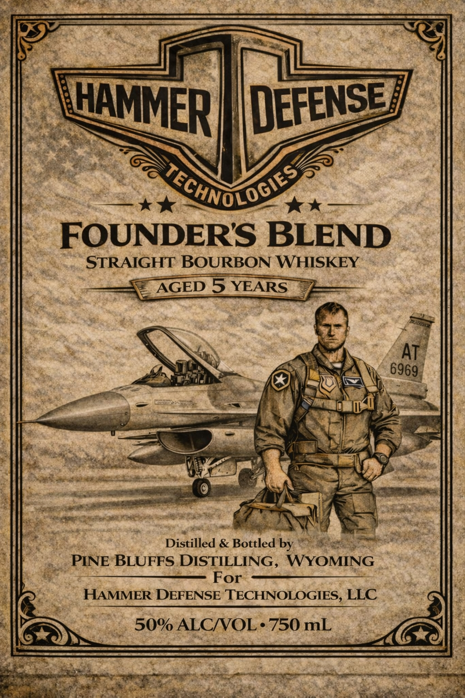

# TTB COLA Label Images - TTBID 26048001000707

**Brand Name:** HAMMER DEFENSE TECHNOLOGIES

**Fanciful Name:** FOUNDERS BLEND

**Issue Date:** 02/20/2026

**Origin Code:** 49

**Product Class/Type:** 101

**Source:** [TTB Public COLA Registry](https://ttbonline.gov/colasonline/viewColaDetails.do?action=publicFormDisplay&ttbid=26048001000707)

## Label Images

### Back Label

### Front Label

## Extracted Label Text

*Text extracted via OCR - may contain errors*

### Back Label

Tee SS SES ERT ES aa cela apace Pane ae, Mage aod oRasioe uaeanie BON oor fe
=tla—E==__~—_— lar
lr _. HAMMER DEFENSE TECHNOLOGIES — “@
ee : aay &
i eee %* PASSION FOR THE WARFIGHTER * |

a i A : * PEOPLE OVER PROFIT * ees ||
AP + INTEGRITY « eS eg ||
‘ hs GOVERNMENT WARNING: (1) ACCORDING TO THE SURGEON GENERAL, WOMEN SHOULD...

- [If NOT DRINK ALCOHOLIC BEVERAGES DURING PREGNANCY BECAUSE OF THE RISK OF BIRTH DEFECTS. -<4}])
[Hl (2) CONSUMPTION OF ALCOHOLIC BEVERAGES IMPAIRS YOUR ABILITY TO DRIVE A CAR OR OPERATE fi.
’ || MACHINERY, AND MAY CAUSE HEALTH PROBLEMS. Pettey || r
|| cueaaeat ‘ : eee a it
— Zs

| | Coe) a cee eani « Ce 2 |(
| SSS Le aE PE

### Front Label

—————

—

Wao

ain

}

HAMMER

GSS

GA

Yen

We

i k*

Now

FOUNDER'S BLEND

STRAIGHT BOURBON WHISKEY

© AGED 5 YEARS 9

Nes

is

VSI

y 8969)

at

cae

re

eT

~~ =

EY

v5

af

Ls

se OF

© ie

AN

RS

Sg

Distilled & Bottled ae

$

PINE*BLUFFS.DISTILLING, WYOMING

or

HAMMER DEFENSE TECHNOLOGIES, LLC

»sS

50% ALC/VOL +750 mL

oi

terse og

aR te te hatte

ip

wats
