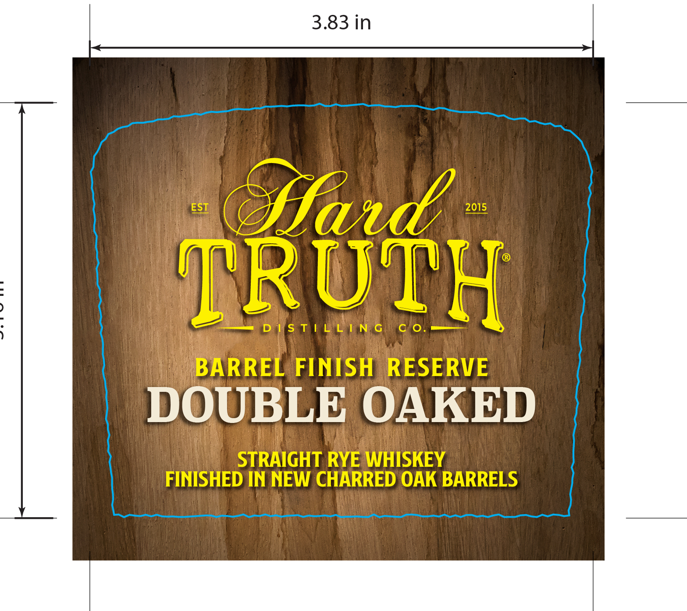

# TTB COLA Label Images - TTBID 26048001000815

**Brand Name:** HARD TRUTH DISTILLING CO.

**Issue Date:** 03/13/2026

**Origin Code:** 19

**Product Class/Type:** 102

**Source:** [TTB Public COLA Registry](https://ttbonline.gov/colasonline/viewColaDetails.do?action=publicFormDisplay&ttbid=26048001000815)

## Label Images

### Back Label

### Label 1

## Extracted Label Text

*Text extracted via OCR - may contain errors*

### Back Label

DISTILLED
WITH THE
FINEST
GRAINS CWATER
BYINDIANAS
SWEET MASH
TM
PIONEERS

### Label 1

3.83 in
EST
Sfaed
2015
)
TRUTH
D IS T / LLIN, G
C 0_
BARREL FINISH
RESERVE
DOUBLE OAKED
STRAIGHT RYE WHISKEY
FINISHED IN NEW CHARRED OAK BARRELS
