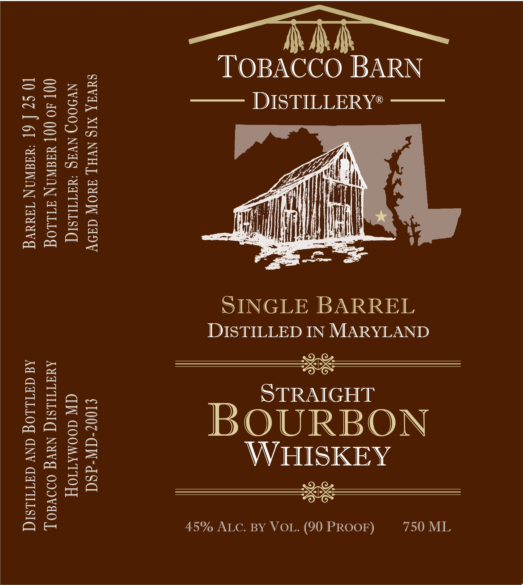
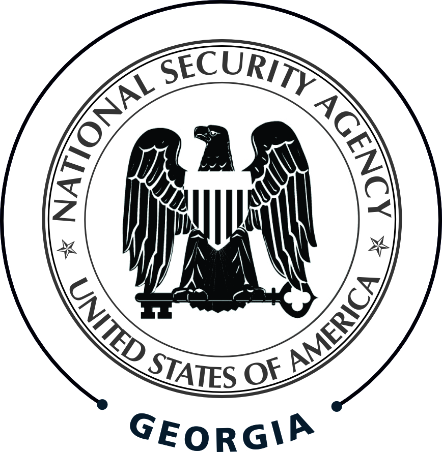

# TTB COLA Label Images - TTBID 26048001000933

**Brand Name:** TOBACCO BARN DISTILLERY

**Issue Date:** 02/19/2026

**Origin Code:** 25

**Product Class/Type:** 101

**Source:** [TTB Public COLA Registry](https://ttbonline.gov/colasonline/viewColaDetails.do?action=publicFormDisplay&ttbid=26048001000933)

## Label Images

### Front Label

### Label 3

## Extracted Label Text

*Text extracted via OCR - may contain errors*

*1 image(s) excluded: text did not meet readability threshold*

### Front Label

A MA
‘TOBACCO BARN
—— DISTILLERY"

750 ML

SINGLE BARREL
DISTILLED IN MARYLAND
Rie
STRAIGHT
WHISKEY
ee

BOURBON

45% ALC. BY VOL. (90 PROOF)

SUVAA XI§ NVH[ daOW Adoy €100¢-dW-dSd
NV900) NVIS ‘YATIULSIG CW GOOMATIOY
00] 40 0O[ XAdNON TILLOG AUITILSIC] NUVG ODDVEO J,

10 SZ { 6] ‘AdaWaN TawUg Ad CYILLOG ANY GATILSIG
