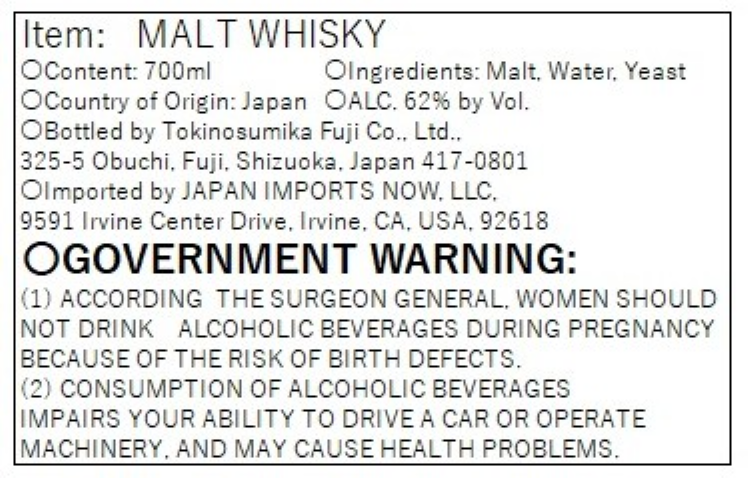
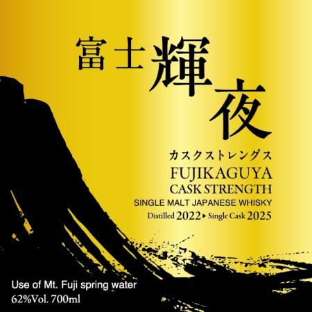

# TTB COLA Label Images - TTBID 26048001000937

**Brand Name:** FUJI KAGUYA CASK STRENGTH

**Issue Date:** 02/20/2026

**Origin Code:** 59

**Product Class/Type:** 118

**Source:** [TTB Public COLA Registry](https://ttbonline.gov/colasonline/viewColaDetails.do?action=publicFormDisplay&ttbid=26048001000937)

## Label Images

### Back Label

### Front Label

## Extracted Label Text

*Text extracted via OCR - may contain errors*

### Back Label

Item: MALT WHISKY

OContent: 700m!

Olngredients: Malt, Water, Yeast

OCountry of Origin: Japan OALC. 62% by Vol.

OBottled by Tokinosumika Fuji Co., Ltd.

325-5 Obuchi, Fuji, Shizuoka, Japan 417-0801

Olmported by JAPAN IMPORTS NOW, LLC,

9591 Irvine Center Drive, Irvine, CA, USA, 92618

OGOVERNMENT WARNING:

(1) ACCORDING THE SURGEON GENERAL, WOMEN SHOULD

NOT DRINK ALCOHOLIC BEVERAGES DURING PREGNANCY

BECAUSE OF THE RISK OF BIRTH DEFECTS.

(2) CONSUMPTION OF ALCOHOLIC BEVERAGES

IMPAIRS YOUR ABILITY TO DRIVE A CAR OR OPERATE

MACHINERY, AND MAY CAUSE HEALTH PROBLEMS.

### Front Label

oe
er

HAVAbLYFA
FUJIKAGUYA
CASK STRENGTH
SINGLE MALT JAPANESE WHISKY
Disilled 2022» Single Cask 2025

Use of Mt. Fuji spring water
62%Vol. 700ml
