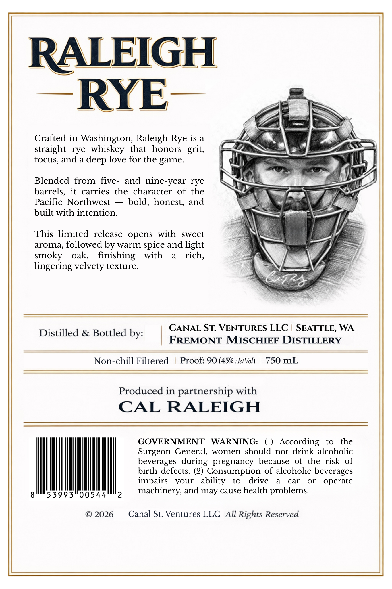
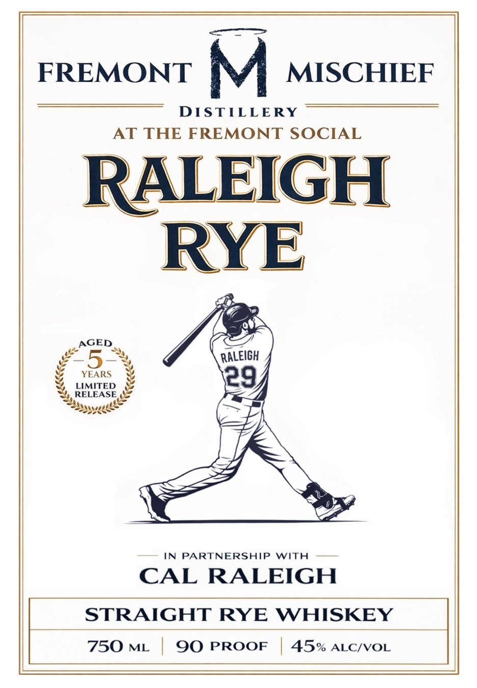

# TTB COLA Label Images - TTBID 26049001000002

**Brand Name:** RALEIGH RYE

**Issue Date:** 02/25/2026

**Origin Code:** 07

**Product Class/Type:** 102

**Source:** [TTB Public COLA Registry](https://ttbonline.gov/colasonline/viewColaDetails.do?action=publicFormDisplay&ttbid=26049001000002)

## Label Images

### Back Label

### Front Label

## Extracted Label Text

*Text extracted via OCR - may contain errors*

**Detected Proof:** 90

### Back Label

NTI
a RY E—

Crafted in Washington, Raleigh Rye is a
straight rye whiskey that honors grit,
focus, and a deep love for the game.

Blended from five- and nine-year rye
barrels, it carries the character of the
Pacific Northwest — bold, honest, and
built with intention.

This limited release opens with sweet
aroma, followed by warm spice and light
smoky oak. finishing with a rich,
lingering velvety texture.

CANAL ST. VENTURES LLC | SEATTLE, WA

Distilled & Bottled by:
ISEINES Se PORE CEn DY, FREMONT MISCHIEF DISTILLERY

Non-chill Filtered | Proof: 90 (45% alc/Vol) | 750 mL

Produced in partnership with

CAL RALEIGH

birth defects. (2) Consumption of alcoholic beverages
impairs your ability to drive a car or operate
machinery, and may cause health problems.

GOVERNMENT WARNING: (1) According to the

Surgeon General, women should not drink alcoholic

beverages during pregnancy because of the risk of
8°" 53993° 00544" 2

©2026 Canal St. Ventures LLC All Rights Reserved

### Front Label

FREMONT M MISCHIEF

DISTILLERY
AT THE FREMONT SOCIAL

RALEIGH

RYE

AGED

>
YEARS
LIMITED
RELEASE.
A

IN PARTNERSHIP WITH ——

CAL RALEIGH

STRAIGHT RYE WHISKEY

750 ML | 90 PROOF | 45% ALc/voL
