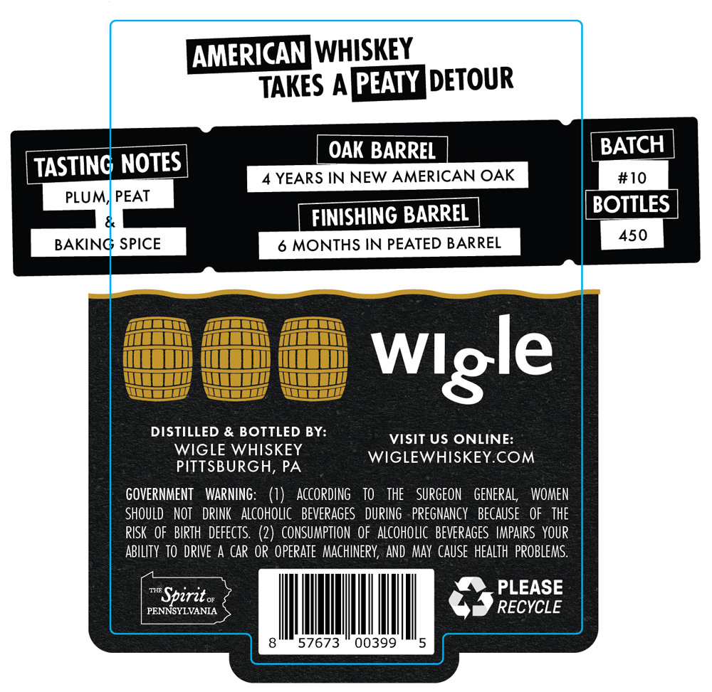
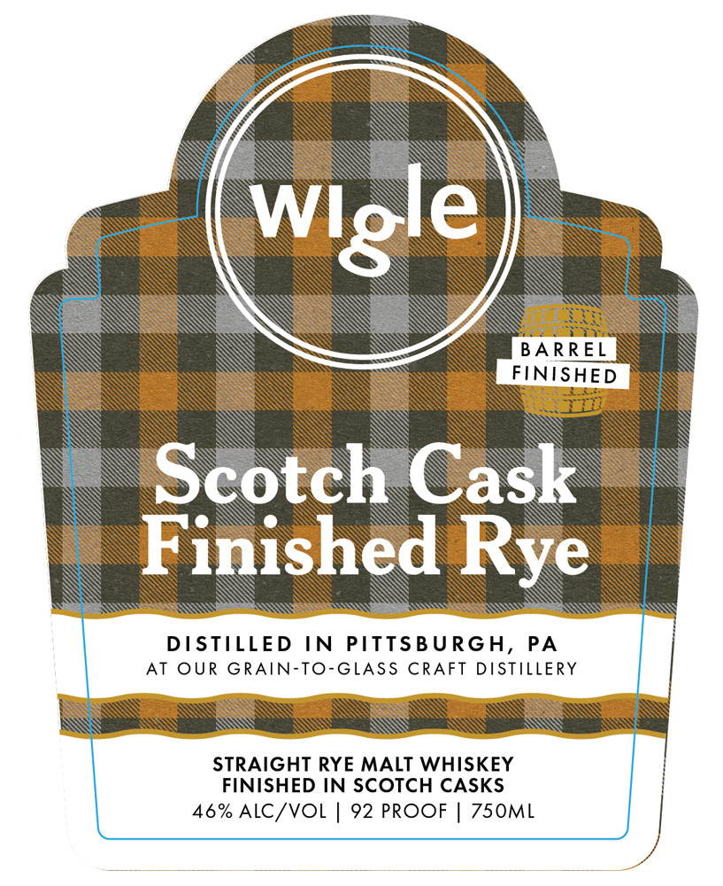

# TTB COLA Label Images - TTBID 26049001000131

**Brand Name:** WIGLE

**Fanciful Name:** SCOTCH CASK FINISHED RYE

**Issue Date:** 02/19/2026

**Origin Code:** 39

**Product Class/Type:** 109

**Source:** [TTB Public COLA Registry](https://ttbonline.gov/colasonline/viewColaDetails.do?action=publicFormDisplay&ttbid=26049001000131)

## Label Images

### Back Label

### Front Label

## Extracted Label Text

*Text extracted via OCR - may contain errors*

**Detected Proof:** 92

### Back Label

AMERICANWHISKEY
TAKES A[PEATY DETOUR
OAK BARREL
BATCH
TASTINC NOTES
YEARS IN NEW AMERICAN OAK
#10
PLUM; PEAT
FINISHING BARREL
BOTTLES
450
BAKING SPICE
6 MONTHS IN PEATED BARREL
DISTILLED
& BOTTLED BY:
VISIT US ONLINE:
WIGLE WHISKEY
WIGLEWHISKEY.COM
PITTSBURGH, PA
GOVERNMENT
WARNING:   (1)
AcCoRdINg
TO
THE
SURGEOn
geneRal;
WOMEN
SHOULD  NOT   DRINK   ALcoholIc   beverages   DURING   PRegnancy   BECAUSe   OF
thE
RISK   OF   BIRTH   defects. (2)   CONSUMPTION  oF alcoholic  beveRAGes  IMPAIRS  YOUR
ABILITy  TO DRIVE A CAR OP operate  MachinerY, AND MAY CAUSe  HeALTh  pRobleMs:
TSpirit o
PLEASE
PENNSYLVANIA
RECYCLE
57673
00399
Wlgle

### Front Label

oe

le

re

Li.

BARREL

EINISHED

wee

Scotch Cask

INIS.

hed

Rye

S

Ss

wisi

=

SISTILLED IN PITTSBURGH, PA

AT OUR GRAIN-TO-GLASS CRAFT DISTILLERY

ee

—

S

STRAIGHT RYE MALT WHISKEY

FINISHED IN SCOTCH CASKS

46% ALC/VOL | 92 PROOF | 750ML

se

ree

es

eee

aentiass

estes
